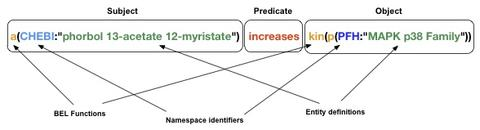

BEL Specification
=================
Natalie Catlett <ncatlett@selventa.com>
v1.0, 2012-07

This is the home of the BEL Language Documentation v 1.0.

Please cite the BEL v1.0 language documentation as "BEL v1.0 Language
Documentation, http://wiki.openbel.org/[http://wiki.openbel.org/]", along with the date accessed.

:numbered!:
[[overview]]
Overview
--------
BEL is a language for representing scientific findings in the life
sciences in a computable form. BEL is designed to represent scientific
findings by capturing causal and correlative relationships in context,
where context can include information about the biological and
experimental system in which the relationships were observed, the
supporting publications cited and the process of curation.

BEL is intended as a knowledge capture and interchange medium,
supporting the operation of systems that integrate knowledge derived
from independent efforts. The language is designed to be use-neutral,
facilitating the storage and use of structured knowledge for inference
by applications through a knowledge assembly process that can create
computable biological networks. While BEL does not prescribe any
particular assembly process or any particular knowledge format for the
output of an assembly process, a suite of software components called the
BEL Framework provides everything necessary to create, compile,
assemble, and deliver computable knowledge models to BEL-aware
applications.

The current version of BEL provides the means to describe biological
interactions qualitatively but not to quantify the magnitude or rate of
these interactions. This limitation is by design because this
quantitative information has significant variability and is not
consistently reported in the literature. It is our hope that future
versions of BEL can accommodate these additional data, and *that YOU are
able to work together with the OpenBEL Consortium to make this happen.*

:numbered:
[[language_structure]]
Language Structure
------------------
Knowledge in BEL is expressed as BEL Statements that are stored in BEL
Documents. BEL Documents are structured text documents that contain BEL
Statements, along with sufficient additional information to fully
describe and process the document.

BEL Statements are generally defined as a semantic triple composed of a
subject - predicate - object where the subject is always a Bel Term and
the object can be either another BEL Term or a BEL Statement. The
predicate is one of the BEL Relationship types describing the
relationship between the subject BEL Term and the object.

.Structure of a BEL Statement

BEL Terms are composed of BEL Functions and entity definitions
referenced using BEL Namespace identifiers. Each BEL Term represents
either an abundance of a biological entity, the abundance of human AKT1
for example, or a biological process such as cardiomyopathy.

Each BEL Statement can optionally be annotated with one or more
references which express additional information about the statement
itself such as the tissue, species, and cell line for example. Within a
BEL Document statements can be associated with a set of Annotation Types
that tag each statement and that can be used to describe the context in
which the statement was observed and increases the richness of the
knowledge being captured.

[[Namespaces]]
Namespaces
~~~~~~~~~~
Apart from a concise set of intrinsic categories of life science
concepts, BEL does not prescribe any specific ontology or vocabulary of
concepts to be used in the representation of life science knowledge.
Rather, BEL is specifically designed to adopt external vocabularies and
ontologies, and therefore represent life-science knowledge in the
language and schema of the organization collecting or using the
knowledge. Thus, biological entities encoded in BEL are defined by
reference to values in external vocabularies, which provide a
specification of a set of well-known domain values such as the set of
Entrez Gene Ids. While we consider it good practice to define biological
entities with respect to well-defined domains such as public ontologies,
no specific vocabulary is essential to the use of BEL, and users are
free to define and reference their own vocabularies as needed.

BEL adopts a concept of Namespaces to disambiguate references for
biological entities. Generally, the user can associate a Namespace
prefix with an external vocabulary and refer to elements of the
vocabulary within the Namespace. For example, if we associate the
Namespace identifier HGNC with the vocabulary of symbols managed by the
HGNC committee, we can then encode BEL Terms by referencing the
Namespace identifier and elements within the Namespace. Thus,
`proteinAbundance(HGNC:AKT1)` and `proteinAbundance(HGNC:TNF)` would be
allowable and valid BEL Terms. However, note that
`proteinAbundance(HGNC:AKT1)` simply means "the class of protein
abundance designated by AKT1 in the HGNC Namespace". Any other knowledge
about the term must be expressed by BEL Statements.

Equivalencing between Namespaces
^^^^^^^^^^^^^^^^^^^^^^^^^^^^^^^^
Values from different Namespaces may correspond to the same biological
concept. For example, the name AKT1 in the HGNC Namespace refers to the
same gene referenced with Id 207 in the Entrez Gene Id Namespace. In
assembling knowledge from BEL Documents, the BEL Compiler/Assembler
attempts to create networks in which a single node corresponds to both
the term `proteinAbundance(HGNC:AKT1)` and `proteinAbundance(EGID:207)`,
where EGID is the namespace identifier for the Entrez Gene vocabulary.
This correspondence of Namespace values is handled in the BEL Framework
separately from knowledge representation in BEL.

The BEL Framework manages equivalencing between Namespace values through
the use of BEL Equivalence Tables. When equivalence tables are specified
as inputs to the knowledge assembly process, the BEL Compiler can
integrate knowledge expressed using terms based on multiple Namespaces.

BEL Terms
---------
Biological entities in BEL are represented by BEL Terms. Two categories of biological entities are represented in BEL: classes of abundances and classes of processes.

Abundances
~~~~~~~~~~
Measured values in life science experiments are often measurements of the abundance of a type of thing in a given sample or set of samples. For example, a probe value measured by a microarray provides a measure of the abundance of RNA matching the probe in the sample, and an appropriate set of probe values may be interpreted as a measure of the abundance of the RNA produced by a specific gene. Some BEL Terms represent classes of abundance, the abundances of specific types of things. Examples include "the protein abundance of TP53", "the RNA abundance of CCND1", "the abundance of the protein AKT1 phosphorylated at serine 21", or "the abundance of the complex of the proteins CCND1 and CDK4".

Processes
~~~~~~~~~
Some BEL Terms may represent classes of complex phenomena taking place at the level of the cell or the organism, such as the process of cell cycle or the process of a disease such as cardiomyopathy. In other cases, BEL Terms may represent classes of specific molecular activities, such as a type of reaction involving small molecules or the kinase activity of a class of proteins. Measurable biological parameters such as systolic blood pressure or body temperature do not correspond to abundances, and can be accommodated by representation as process BEL Terms. These BEL Terms thereby denote biological activities that, when measured, are reduced to an output parameter.

BEL Terms as Functional Expressions
~~~~~~~~~~~~~~~~~~~~~~~~~~~~~~~~~~~
BEL Terms are denoted by expressions composed of a BEL Function and a list of arguments. BEL V1.0 specifies a set of over 30 intrinsic functions allowed in term expressions. The combination of a term function and its arguments fully specifies a represented biological entity. The BEL Term expression +f(a)+ denotes a BEL Term defined by function +f()+ applied to an argument +a+. Wherever the same function applied to the same arguments is defined, BEL assumes these BEL Terms denote the same biological entity. The semantics of a BEL Term are determined by the definition of the function used in the term expression. For example, the function proteinAbundance() is defined such that any expression using proteinAbundance() represents a class of abundance of protein. Many functions used in BEL take only single values as arguments and provide a structured method of adopting ontologies and vocabularies for use in BEL. For example, values in the HUGO Gene Nomenclature Committee (HGNC) vocabulary of official human gene names can be used to designate gene, RNA, and protein abundances. The function +proteinAbundance()+ could then be applied to an HGNC gene symbol, AKT1 for example, to indicate the class of protein abundances produced by the corresponding gene. Thus, we might encode the BEL Term +proteinAbundance(AKT1)+.

Term Disambiguation via Namespaces
~~~~~~~~~~~~~~~~~~~~~~~~~~~~~~~~~~
As gene symbols, and more generally, names in life sciences as a rule are often ambiguous, it is more precise to reference the vocabulary as well as the symbol when designating a term identifying an abundance or biological process. To this end, we would prefer to write +proteinAbundance(HGNC:AKT1)+ so that we can provide an exact specification of the protein abundance being referenced. The designation of a term parameter such as AKT1 referenced with respect to an external ontology, HGNC in this case, is central to the BEL language. Generally, all term parameters are defined within a Namespace identifying the vocabulary used to identify the term parameter. BEL provides the ability to use existing namespaces or to create your own namespaces.

BEL Statements
--------------

BEL Statements are expressions that represent knowledge of the existence of biological entities and relationships between them that are known to be observed within a particular context, based on some source of prior knowledge such as a scientific publication or newly generated experimental data.
Most BEL Statements represent relationships between one BEL Term and another BEL Term or BEL Statement. This type of BEL Statement represents an assertion of a relationship between the subject and object. BEL defines an intrinsic set of relationship types used to represent the type of relationship observed. If the object of a BEL Statement is another BEL Statement, the BEL Statement is said to be nested and the relationship type is constrained to the set of causal relationship types. A nested BEL Statement represents a causal relationship between two terms, which is in turn causally affected by a third term. An example would be "A increases the process in which B decreases C".In its simplest form a BEL Statement contains a single BEL Term and no relationship. This type of BEL Statement can be used to establish that a BEL Term has been observed in the context of the BEL Statement. A typical example of such a statement would be one that contains a molecular complex term. Such a BEL Statement would assert that the complex has been observed. Statements of this type can capture binding relationships between classes of molecular abundances.

Examples of BEL Statements
~~~~~~~~~~~~~~~~~~~~~~~~~~

[source,java]
----
complex(p(HGNC:CCND1), p(HGNC:CDK4))
----
The abundance of the complex of the proteins designated by *CCND1* and *CDK4* in the HGNC namespace has been observed in this context.

[source,java]
----
p(HGNC:CCND1) => kin(p(HGNC:CDK4))
----
Increased abundance of the protein designated by *CCND1* in the HGNC namespace directly increases the kinase activity of the abundance of the protein designated by *CDK4* in the HGNC namespace.

[source,java]
----
p(HGNC:BCL2)-| bp(MESHPP:Apoptosis)
----
Increased abundance of the protein designated by *BCL2* in the HGNC namespace decreases the biological process designated by *apoptosis* in the MESHPP (phenomena and processes) namespace.

[source,java]
----
p(HGNC:GATA1) => ( tscript(p(HGNC:ZBTB16)) => r(HGNC:MPL) )
----
Increased abundance of the protein designated by *GATA1* in the HGNC namespace directly increases the process in which the transcriptional activity of the protein abundance designated by *ZBTB16* in the HGNC namespace directly increases the abundance of RNA designated by *MPL* in the HGNC namespace.

Annotations
-----------

Each BEL Statement can optionally be annotated to express knowledge about the statement itself. Some important uses of annotations are to:

*   Specify information about the biological system in which the facts represented by the statement hold or were demonstrated,
*   Specify information about the experimental methods used to demonstrate the facts, and
*   Specify information about the knowledge source on which the statement is based, such as the citation and the specific text supporting the statement.

Examples of annotations that could be associated with a BEL Statement are the:

*   PubMed id specifying the publication in which the findings were reported,
*   Species, tissue, and cellular location in which the observations were made, and
*   Dosage, exposure and recovery time for an experimental result.

BEL allows annotations to be defined to meet the needs of the knowledge designer. The knowledge designer can define and use their own annotations, or use one or more provided by the BEL Framework. Annotation Types are defined within a BEL Document and each Annotation Type has the following characteristics:

*   A unique name within a BEL Document,
*   A pre-specified domain of allowable values, and
*   Optionally, usage information and a description.

Each Annotation Type is given a unique name within a BEL Document. Examples of Annotation Type names might be Species, ExperimentType, Dosage, and ExposureTime. Each Annotation Type must have a domain of allowable values associated with it. BEL supports three (3) ways in which domain values for an Annotation Type may be specified:

*   An externally specified enumerated list, such as the set of NCBI Taxonomy IDs,
*   An internally specified enumerated list, and
*   A regular expression.

Internally specified lists can be defined within a BEL Document. These lists enumerate the set of allowable domain values for statements using the Annotation Type within the BEL Document. For example, an annotation type named _dosage_ might have the domain values +{"LOW", "MEDIUM", "HIGH"}+ specified as a list.

Annotation Types defined using a regular expression domain allow the knowledge designer to specify which strings are allowed for statements using the Annotation Type within the BEL Document. For example, a regular expression such as `[-+]?[0-9]*\.?[0-9]+` can be used to constrain the annotation type to only allow floating-point numbers.

Reserved Annotation Types
~~~~~~~~~~~~~~~~~~~~~~~~~
The following commonly used Annotation Types are reserved by BEL and cannot be redefined. These annotation types have been selected to promote interoperability of knowledge by the use of a common contextual vocabulary.

Citation
~~~~~~~~
Enables BEL Statements to be annotated with the knowledge source cited to support the relationship expressed by the statement.

Evidence
~~~~~~~~
Enables BEL Statements to be annotated with the exact evidence line from a citation that supports the relationship expressed by the statement.

Other Available Annotation Types
~~~~~~~~~~~~~~~~~~~~~~~~~~~~~~~~
The BEL Framework provides nineteen (19) additional annotation types that can be used. These annotations cover species, cell lines, tissues, diseases, cellular locations, and other commonly used standardized annotation types.

[[bel-script]]
BEL Script, Version 1.0 Format
------------------------------

BEL Script is a syntax and format for encoding BEL Statements and associated annotations as human-readable documents that can also be efficiently processed by the BEL Framework. BEL Script is an alternative to encoding BEL Statements using the http://resource.belframework.org/belframework/1.0/schema/[XBEL XML format].

Both BEL Script and XBEL are document formats, that is, they have a specialized structure and have several sections that enable the BEL Framework to determine how to process and interpret BEL Statements. This document describes the overall document structure and provides examples of encoding BEL Statements using the BEL Script format.

Overview
~~~~~~~~

BEL Script Overview
^^^^^^^^^^^^^^^^^^^

BEL Script is a syntax and document format for storing multiple BEL Statements in a single text file and associating statement annotations, namespaces, and provenance with the statements.

BEL Script can be written using any text editor or word processor application that can save documents as simple text files. Each BEL Script is composed of records (rows) in the file which either:

*   specify a BEL Statement using BEL
*   provide a control record, or
*   define a comment.

BEL Script Sections
^^^^^^^^^^^^^^^^^^^

BEL Scripts are composed of three (3) functional sections:

*   Properties
*   Definitions
*   Statements

BEL Scripts are processed from top to bottom, thus the ordering of sections within the document and of records within each section is important.

Properties Section
^^^^^^^^^^^^^^^^^^

The Properties section contains a set of control records that define the provenance for the document. This section includes control records that can identify when the document was created, the organization that created the document, copyright information if needed, and additional information that can be included to identify how the BEL Statements were processed.

The following BEL Document Properties are recognized:

|====
| Authors
| ContactInfo
| Copyright
| Description
| Disclaimer
| Licenses
| Name
| Version
|====

Definitions Section
^^^^^^^^^^^^^^^^^^^

The Definitions section contains a set of control records that define the Namespaces and Annotation Types used within the document. Namespace control records are used to identify external vocabularies and ontologies that are used to identify entities within BEL Terms. Annotation Type control records define the set of annotations that can be used by BEL Statements within the document.

Statement Section
^^^^^^^^^^^^^^^^^

The Statement section is the last section in the document and contains a set BEL Statements and control records that associate Annotations and comments with the BEL Statements. Each BEL Statement records a biological fact.

Control Records
~~~~~~~~~~~~~~~

Control records are records that begin with a control action keyword. The BEL Script syntax supports the following control actions:

*   SET
*   DEFINE
*   UNSET

SET
^^^

The SET action instantiates an object of a given type and assigns specific properties to that object reference. This action is used in the Properties section to associate provenance information with the statements that follow in the Statements section, and in the Statements section to associate annotations with specific BEL Statements. The SET action can also define a new Statement Group.

Usage
+++++

Sets an annotation value, statement group name, or a document level property. Document-level properties must be set before all other annotations and BEL Statements.   
Once set, document-level properties cannot be cleared. If the same document-level property is set multiple times, the last value takes precedence.

If a statement group is set, all following statements will be associated with the statement group. If no statement group is set, all statements will be associated with the default (unnamed) statement group.

The annotation will be associated with all BEL Statements after this command unless it is explicitly cleared with the UNSET action. If the annotation is previously set, the SET action changes its value. Use commas (,) to separate multiple values for the same annotation.

Syntax
++++++
[source,java]
----
SET [DOCUMENT ] name = value | {value, value,…}
SET STATEMENT_GROUP = value
----

Examples
++++++++
[source,java]
----
SET BodyPart = {"lung", "liver", "kidney"}

SET DOCUMENT Version = "1.0"

SET DOCUMENT License = "LGPL"

SET DOCUMENT Name = "Test Document"

SET STATEMENT_GROUP = "PubMed 123456"
----

DEFINE
^^^^^^
The DEFINE action instructs the BEL Script interpreter to define a new object type and associate specific properties to that object type.

This action is used to define new Namespace references and new Annotation Types in the Definitions section of the BEL Script.

Usage
+++++
Define a namespace or annotation in the document. Three value types are supported:

|====
| URL | A Uniform Resource Locator that can be used to retrieve a Namespace or Annotation Type definition.
| LIST | A comma separated list of possible values, list surrounded by { and } characters. Can only be used with the ANNOTATION keyword.
| PATTERN | A regular expression pattern that can be used to constrain the values associated with an Annotation Type. Can only be used with the ANNOTATION keyword
|====

Syntax
++++++
[source,java]
----
DEFINE [ ANNOTATION | [DEFAULT] NAMESPACE ] name AS [ URL | LIST | PATTERN ] value | { value, values, …}
----

Examples
++++++++
The following example defines the EGID Namespace value. The Namespace identifier EGID is associated with the Namespace defined using the URL.

[source,java]
----
DEFINE DEFAULT NAMESPACE EGID AS URL \
    "http://resource.belframework.org/belframework/1.0/ns/entrez-gene-ids-hmr.belns"
----

This next example defines an Annotation Type named ExposureTime and restricts allowable values to the regular expression.

[source,java]
----
DEFINE ANNOTATION ExposureTime AS PATTERN "[0-9]+ hours"
----

This next example defines an Annotation Type named Dosage and restricts allowable values to the predefined set of values.

[source,java]
----
DEFINE ANNOTATION Dosage AS LIST {"low", "medium", "high"}
----

UNSET
^^^^^
The UNSET action clears one or more previously SET annotations such that any following BEL Statement does not get annotated with the annotations. If the UNSET action is applied to STATEMENT_GROUP any statements following the UNSET command will be assigned to the default statement group and all annotations associated will be restored to the state prior to the SET STATEMENT_GROUP command.

Usage
+++++
The UNSET action can unset a single previously SET annotation, a list of previously SET annotation types or unset all currently set annotation types. Statements after the UNSET action will not be associated with the annotation unless they are explicitly set again with the SET action.

If the Annotation Type identified in the UNSET action is not defined, an Error will be generated during processing.

If the Annotation Type identified in the UNSET action is not SET, a Warning will be generated during processing.

Syntax
++++++
[source,java]
----
UNSET [ name | { name, name,…} | ALL ]

UNSET STATEMENT_GROUP
----

Examples
++++++++
The following example will UNSET the ExposureTime Annotation Type.
[source,java]
----
UNSET ExposureTime
----

This example will UNSET all currently set Annotations.
[source,java]
----
UNSET ALL
----

This example will UNSET the Annotations names rating, quality and species.
[source,java]
----
UNSET {ExposureTime, Dosage, Species}
----

This example will UNSET the current Statement Group
[source,java]
----
UNSET STATEMENT_GROUP
----
  

Language Characteristics
~~~~~~~~~~~~~~~~~~~~~~~~

This page provides information about other characteristics of the BEL Script format.

Reserved Keywords
^^^^^^^^^^^^^^^^^
The following keywords are reserved for use in BEL Script documents:

|====
| ALL | ANNOTATION | AS | DEFAULT
| DEFINE | DOCUMENT | LIST | NAMESPACE
| PATTERN | SET | STATEMENT_GROUP | UNSET
| URL |   |   |  
|====

Case Sensitivity
^^^^^^^^^^^^^^^^
BEL and BEL Script are case sensitive. All relationship types, function names, and reserved keywords are case sensitive.

Annotation Type names and annotation values are case specific.

Namespace identifiers are case specific. The case sensitivity of namespace values is defined within the Namespace itself but most Namespaces default to being case sensitive.

Blank Lines
^^^^^^^^^^^
BEL Script allows blank lines in any section. Blank lines are ignored by the BEL Script processor.

Quotes
^^^^^^
All URLs used in Annotation Types or Namespace definitions in the Definitions section need to be quoted with double quotes.

Any string identifiers that contain non-alphanumeric characters including white space should be quoted. For example, the following BEL Statement

[source,java]
----
p(CHEBI:"4-fluoro-N-{2-[4-(7-methoxynaphthalen-1-yl)piperazin-1-yl]ethyl}benzamide(1+)") -> bp(GO:"cell proliferation")
----

would be correctly interpreted.

Escape Sequences in Quotes
^^^^^^^^^^^^^^^^^^^^^^^^^^

Some characters must be escaped (using an http://en.wikipedia.org/wiki/Escape_sequence[escape sequence]) for it to be recognized in a quoted string.  The following escape sequences are supported:

|====
| Name | Escape Sequence | Description
| Backslash | \\ | Include an actual backslash character in the string.
| Backspace control character | \b | Captures a backspace control character (less used).
| Tab | \t | Captures a tab character.
| Newline | \n | Captures a newline character.
| Form feed | \f | Captures a form feed character.
| Carriage return | \r | Captures a carriage return character.
| Double quote | \" | Captures a double quote character.
| Single quote | \' | Captures a single quote character.
| Unicode | \uXXXX (X = hexidecimal 0 - F) | Captures a unicode character.  For example \u2026 represents the horizontal ellipsis (
…
).
| Octal | \OOO, \OO, or \O

(O = octal 0 - 7) | Captures a character by its octal value.
|====

Object Identifiers
^^^^^^^^^^^^^^^^^^
Annotation Type and Namespace identifiers must contain only alphanumeric characters and underscore (+_+). They must not begin with number. By convention BEL Script uses Camel Case for object identifiers.

Examples of Valid Object Identifiers
+++++++++++++++++++++++++++++++++++++
*   Quality
*   ExperimentType
*   experiment_type
*   Rating
*   Workflow
*   ReviewStatus

Examples of Invalid Object Identifiers
++++++++++++++++++++++++++++++++++++++
*   Experiment type (space is not allowed)
*   2nd_time_point (begins with a number)

List Operator
^^^^^^^^^^^^^
Certain control records take a list of arguments as input. A list is defined by enclosing comma separated values in +{+ and +}+ braces.

The following are examples of using the list operator:

[source,java]
----
SET BodyPart = {"lung", "liver"}

SET Citation = {"document type", "document name", "publication id"}
----

A List can be nested within another list if the operation takes a list of lists as values.

Line Continuation Operator
^^^^^^^^^^^^^^^^^^^^^^^^^^
Statements in a BEL Script are processed one line at a time. Multiple lines can be grouped together by using the line continuation operator +\+. In this case, the lines are processed as a single statement. For example, the following two statements have the same meaning:

Statement Example
+++++++++++++++++
[source,java]
----
# without line continuator
kinase(p(HGNC:IGFI1R)) -| (p(HGNC:BNIP3) -> bp(GO:apoptosis))

# with line continuator
kinase(p(HGNC:IGFI1R)) -| \
 (p(HGNC:BNIP3) -> bp(GO:apoptosis))
----

Comments
^^^^^^^^
BEL Script supports both Document-level and Statement-level comments in a script file.

Document Comments
^^^^^^^^^^^^^^^^^
Document-level comments can be positioned anywhere in a document. These comments do not get processed and are not stored once the BEL Script is imported into a Document Store. A document-level comment starts with a pound sign (+#+) character that must be the first character in the record.

The following are examples for document-level comments:

[source,java]
----
# document generated by NLP algorithm ABC on December 22, 2010
# most statements in this document are from a PubMed document
----

Statement Comments
^^^^^^^^^^^^^^^^^^
BEL Script supports in-line comments associated with BEL Statements. In-line comments can be used after any BEL Statement. Each Statement comment starts with a double slash +//+ followed by the comment text. All text following the comment is processed by the interpreter and will be imported into a BEL Document Store and associated with the BEL Statement.

The following is an example of a Statement-level comment:

[source,java]
----
tscript(p(HGNC:TP53)) -> r(HGNC:FAS) // apoptosis related gene
----

Example BEL Script
~~~~~~~~~~~~~~~~~~

The following is an example of a BEL Script document created from a PubMed abstract.

Additional BEL Script examples can be found http://resource.belframework.org/belframework/1.0/knowledge/[here].  

[source,java]
----
##############################################################################
#                                                                          
#
# Example BEL Script.                                                      
#
#                                                                           
# This BEL Script encodes BEL Statements extracted from PubMed ID 11340296   #
#                                                                          
#
##############################################################################

##############################################################################
#
# Properties Section
# This section is used to define properties associated with the document as a
# whole.
#
# Set the Citation for the Document. This is generally used to define who
# created the document.

SET DOCUMENT Name = "Example BEL Script Document"

SET DOCUMENT Authors = "Selventa"

SET DOCUMENT Version = "1.0"

SET DOCUMENT Copyright = "Copyright (c) 2011, Selventa. All Rights Reserved"

# Set additional information for the Document. This is generally used to define why
# the document was created and what it can be used for.

SET DOCUMENT Description = "This document provides an illustration of the structure
of a BEL Script document and the encoding of BEL Statements"

##############################################################################
#
# Definitions Section
# This section is used to define the Namespaces and Annotation Types that will
# be used within the document.
#
# First define the Namespaces for term parameters. One Namespace can be set as
# the DEFAULT Namespace for the document

DEFINE DEFAULT NAMESPACE HGNC AS URL \
 "http://resource.belframework.org/belframework/1.0/ns/hgnc-approved-\
 symbols.belns"

DEFINE NAMESPACE EGID AS URL \
 "http://resource.belframework.org/belframework/1.0/ns/entrez-gene-ids-hmr.belns"

# Next define Annotation Types to be used to annotate the BEL Statements that are
# defined later on

# Here we set up a species annotation using the pre-defined species annotation type

# This species annotation uses NCBI TAX IDs

DEFINE ANNOTATION Species AS URL \
 "http://resource.belframework.org/belframework/1.0/annotation/species-taxonomy-id.belanno"

# Define a Tissues annotation type

DEFINE ANNOTATION Tissue AS URL \
 "http://resource.belframework.org/belframework/1.0/annotation/mesh-tissue.belanno"

# Define an ExposureTime Annotation Type using a REGEX pattern

DEFINE ANNOTATION ExposureTime AS PATTERN "[0-6]hr"

##############################################################################
#
# Statements Section
# This section is used to encode BEL Statements using the Namespaces and
# Annotation Types previously defined.
#
# Set the citation for the PubMed article being used. The Citation and Evidence
# Annotation types are part of the BEL specification and don't need to be defined as
# Annotation Types
# Set the statement group. All following statements will be assigned to this group

SET STATEMENT_GROUP = “PubMed 11340296”

SET Citation = {“PubMed”, "Exp Clin Immunogenet, 2001;18(2) 80-5", "11340296"}

# Set document-defined annotation values

SET Species = 9606

SET Tissue = "t-cells"

# Create an Evidence Line for a block of BEL Statements

SET Evidence = "Here we show that interfereon-alpha
 (IFNalpha) is a potent producer of SOCS expression in human T cells, as high expression of CIS, SOCS-1, SOCS-2,
 and SOCS-3 was detectable after IFNalpha stimulation. After 4 h of stimulation CIS, SOCS-1, and SOCS-3 had returned to baseline
 levels, whereas SOCS-2 expression had not declined."

SET ExposureTime = "4hr"

# Create some BEL Statements. The following statements will be annotated with Citation,

# Species, Tissue, Evidence and ExposureTime annotation type values defined above.

p(HGNC:IFNA1) -> r(HGNC:CISH) // protein abundance of IFNA1 increases the rna \
      abundance of CISH

p(HGNC:IFNA1) -> r(HGNC:SOCS1) // protein abundance of IFNA1 increases the rna \
      abundance of SOCS1

p(HGNC:IFNA1) -> r(HGNC:SOCS2) // protein abundance of IFNA1 increases the rna \
      abundance of SOCS2

p(HGNC:IFNA1) -> r(HGNC:SOCS3) // protein abundance of IFNA1 increases the rna \
      abundance of SOCS3

# Reset the Evidence line and ExposureTime Annotation Type values

SET Evidence = "In contrast, after IL-2 induction neither CIS, SOCS-1, nor SOCS-2
 expression levels declined after 6h."

SET ExposureTime = "6hr"

# The following statements will be annotated with Citation, Species,
# Tissue, Evidence and ExposureTime annotation type values defined above.

p(HGNC:IL2) -> r(HGNC:CISH)       // protein abundance of IL2 increases the rna \
    abundance of CISH

p(HGNC:IL2) -> r(HGNC:SOCS1)      // protein abundance of IL2 increases the rna \
    abundance of SOSC1

p(HGNC:IL2) -> r(HGNC:SOCS2)      //protein abundance of IL2 increases the rna \
    abundance of SOSC2
----

BEL Functions
-------------

This section provides a listing of all BEL functions that are included in the BEL V1.0 Language Specification.

Abundance functions
~~~~~~~~~~~~~~~~~~~

The following BEL Functions represent classes of abundances of specific types of biological entities like RNAs, proteins, post-translationally modified proteins, and small molecules. Biological experiments frequently involve the manipulation and measurement of entities in samples. These BEL functions specify the type of entity referred to by a namespace value. For example+geneAbundance(HGNC:AKT1+), +rnaAbundance(HGNC:AKT1)+, and +proteinAbundance(HGNC:AKT1)+, represent the abundances of the AKT1 gene, RNA, and protein, respectively.

abundance(), a()
^^^^^^^^^^^^^^^^

+abundance(ns:v)+ or +a(ns:v)+ denotes the abundance of the entity designated by the value +v+ in the namespace +ns+. abundance is a general abundance term that can be used for chemicals or other molecules not defined by a more specific abundance function. Examples of abundances include small molecules and chemicals, such as +a(CHEBI:"oxygen atom")+ and +a(CHEBI:thapsigargin)+. Gene, RNA, protein, and microRNA abundances should be represented using the appropriate specific abundance function.

complexAbundance(), complex()
^^^^^^^^^^^^^^^^^^^^^^^^^^^^^
The +complexAbundance()+ or+ complex()+ function can take a list of one or more namespace values.   
+complexAbundance(ns:v)+ denotes the abundance of the molecular complex designated by the value +v+ in the namespace +ns+. This form is generally used to identify abundances of named complexes, for example the activator protein 1 (AP-1) transcription complex can be represented as:
[source,java]
----
complexAbundance(NCH:"AP-1 Complex")
----

+complexAbundance(<abundance term list>)+ denotes the abundance of the molecular complex of members of the abundances denoted by +<abundance term list>+, a list of abundance terms supplied as arguments. BEL assumes that the list is unordered, thus different orderings of the arguments will be interpreted as the same term. For example, the FOS JUN AP-1 complex can be represented as:

[source,java]
----
complex(p(HGNC:FOS), p(HGNC:JUN))
----

or equivalently as

[source,java]
----
complex(p(HGNC:JUN), p(HGNC:FOS))
----

Members of a molecular complex retain their individual identities. The +complexAbundance()+ function does not specify the duration or stability of the interaction of the members of the complex.

compositeAbundance(), composite()
^^^^^^^^^^^^^^^^^^^^^^^^^^^^^^^^^
The +compositeAbundance(<abundance term list>)+ function takes a list of abundances.   
The +compositeAbundance()+ or +composite() +function is used to represent cases where multiple abundances synergize to produce an effect. For example "treatment with A and B together increases C", where can be represented as:

[source,java]
----
compositeAbundance(a(A), a(B)) increases C
----

This function should not be used if A or B alone are reported to cause C. +compositeAbundance() +terms should be used only as subjects of statements, not as objects.

geneAbundance(), g()
^^^^^^^^^^^^^^^^^^^^

+geneAbundance(ns:v)+ or +g(ns:v)+ denotes the abundance of the gene designated by the value v in the namespace ns. +geneAbundance() +terms are used to represent the DNA encoding the specified gene. +geneAbundance()+ is considered decreased in the case of a homozygous or heterozygous gene deletion, and increased in the case of a DNA amplification mutation. Events in which a protein A binds to the promoter of a gene B can be represented using the +geneAbundance()+ function as follows:

[source,java]
----
complexAbundance(p(A), g(B))
----

microRNAAbundance(), m()
^^^^^^^^^^^^^^^^^^^^^^^^
+microRNAAbundance(ns:v)+ or +m(ns:v)+ denotes the abundance of the processed, functional microRNA designated by the value+ v+ in the namespace +ns+. For example, human microRNA 21 can be represented as:

[source,java]
----
microRNAAbundance(HGNC:MIR21)
----

proteinAbundance(), p()
^^^^^^^^^^^^^^^^^^^^^^^
+proteinAbundance(ns:v)+ or +p(ns:v)+ denotes the abundance of the protein designated by the value +v+ in the namespace +ns+, where +v+ references a gene or a named protein family. Examples of protein abundances are:

[source,java]
----
proteinAbundance(HGNC:AKT1)
p(PFH:"AKT family")
----

rnaAbundance(), r()
^^^^^^^^^^^^^^^^^^^
+rnaAbundance(ns:v)+ or +r(ns:v)+ denotes the abundance of the RNA designated by the value v in the namespace +ns+, where +v+ references a gene. This function refers to all RNA designated by +ns:v+, regardless of splicing, editing, or polyadenylation stage. An example of RNA abundance is the human AKT1 messenger RNA:

[source,java]
----
r(HGNC:AKT1)
----

Modifications
~~~~~~~~~~~~~

The following functions represent covalent modifications or sequence variation of protein, RNA, or gene abundances. These modifications are special functions that can only be used as an argument within an abundance function.

Covalent modifications
^^^^^^^^^^^^^^^^^^^^^^

proteinModification(), pmod()
+++++++++++++++++++++++++++++
The proteinModification() or pmod() function can be used only as an argument within a +proteinAbundance()+ function to indicate covalent modification of the specified protein. Covalently modified protein abundance term expressions have the form:

[source,java]
----
p(ns:v, pmod(<type>, <code>, <pos>))
----

Where +<type>+ is one of a set of 9 covalent protein modification types, +<code>+ is one of the 20 single-letter amino acid codes, and <pos> is the position at which the modification occurs based on the reference sequence for the protein.  
If +<pos>+ is omitted, then the position of the modification is unspecified. If both+ <code>+ and +<pos>+ are omitted, then the residue and position of the modification are unspecified.

An example of a protein modification code would be "P", denoting phosphorylation:

[source,java]
----
p(HGNC:AKT1, pmod(P, S, 21))
----

defines the abundance of human AKT1 phosphorylated at serine 21.

[source,java]
----
p(HGNC:AKT1, pmod(P, S))
----

defines the abundance of human AKT1 phosphorylated at an unspecified serine.

[source,java]
----
p(HGNC:AKT1, pmod(P))
----

defines the abundance of human AKT1 with unspecified phosphorylation.

The following modification types are supported:

|====
| Type | Modification
| P | Phosphorylation
| A | Acetylation
| F | Farnesylation
| G | Glycosylation
| H | Hydroxylation
| M | Methylation
| R | Ribosylation
| S | Sumoylation
| U | Ubiquitination
|====

The following single-letter Amino Acid codes are supported:

|====
| Code | Amino Acid
| A | Alanine
| R | Arginine
| N | Asparagine
| D | Aspartic Acid
| C | Cysteine
| E | Glutamic Acid
| Q | Glutamine
| G | Glycine
| H | Histidine
| I | Isoleucine
| L | Leucine
| K | Lysine
| M | Methionine
| F | Phenylalanine
| P | Proline
| S | Serine
| T | Threonine
| W | Tryptophan
| Y | Tyrosine
| V | Valine
|====

Sequence Variations
^^^^^^^^^^^^^^^^^^^

substitution(), sub()
+++++++++++++++++++++
The +substitution()+ or +sub()+ function can be used only as an argument within a +proteinAbundance()+ function to indicate amino acid substitution of the specified protein, generally resulting from a missense polymorphism or mutation in the corresponding gene. Expressions indicating the abundance of proteins with amino acid substitution sequence variants have the form:

[source,java]
----
p(ns:v, sub(<code_reference>, <pos>, <code_variant>))
----

Where +<pos>+ is the position at which the substitution occurs based on the reference sequence for the protein, +<code_reference>+ is one of the single-letter amino acid codes and specifies the amino acid at that position in the reference sequence for the protein and +<code_variant>+ specifies the amino acid at that position in the variant sequence for the protein.

[source,java]
----
p(HGNC:KRAS, sub(G, 12, V))
----

defines the abundance of human KRAS in which a glycine is substituted with valine at codon 12.

truncation(), trunc()
+++++++++++++++++++++
The +truncation()+ or +trunc()+ function can only be used as an argument within a +proteinAbundance()+ function to indicate a truncated protein, generally resulting from a gene sequence variation like a frame shift or nonsense mutation. Expressions indicating the abundance of proteins with truncation sequence variants have the form:

[source,java]
----
p(ns:v, truncation(<pos>))
----

Where +<pos>+ is the position at which the truncation occurs based on the reference sequence for the protein,

[source,java]
----
p(HGNC:KRAS, truncation(55))
----

defines the abundance of human KRAS truncated at position 55.

fusion(), fus()
+++++++++++++++
Expressions indicating the abundance of genes, proteins, and rna with fusion modifications have the form: +x(ns1:v1, fus(ns2:v2, a, b))+ Where x is either a proteinAbundance, a geneAbundance or a rnaAbundance, ns1:v1 is the 5' (left side) partner gene and ns2:v2 is the 3' (right side) partner gene, a and b are the breakpoints for the 5' and 3' genes respectively.

If a and b are omitted, the position of the 5' and 3' breakpoints are unspecified.  
The following example of a fusion modification+:+

[source,java]
----
g(HGNC:TMPRSS2, fusion(HGNC:ERG, 365, 38))
----

defines the abundance of human TMPRSS2-ERG fusion gene which encodes nucleotide 1-365 of TMPRSS2 fused to nucleotide 38-3097 of ERG.  
If the breakpoint were unknown or unspecified the fusion gene would be represented as:

[source,java]
----
g(HGNC:TMPRSS2, fusion(HGNC:ERG))
----

Activities
~~~~~~~~~~

Activity functions are applied to protein, complex, and RNA abundances to specify the frequency of events resulting from the molecular activity of the abundance. Activity functions provide distinct terms that differentiate the molecular activity from the abundance of a protein, complex, or RNA.

catalyticActivity(), cat()
^^^^^^^^^^^^^^^^^^^^^^^^^^
For the abundance term A, +catalyticActivity(A)+ or +cat(A)+ denotes the frequency or abundance of events in which a member of A acts as an enzymatic catalyst of biochemical reactions; A should represent an abundance of a protein, molecular complex, or ribozyme with catalytic activity, such as super oxide dismutase 1 (+p(HGNC:SOD1)+) or the RNA polymerase II complex (+complex(NCH:"RNA polymerase II complex")+ ).  

In BEL V1.0, certain types of catalytic activity are represented by a more specific activity function. These include kinase (phosphotransferase), ADP-ribosylase, phosphatase, and peptidase (protease). To represent these types of activities, the more specific function should be used.

chaperoneActivity(), chap()
^^^^^^^^^^^^^^^^^^^^^^^^^^^
For the abundance term A, +chaperoneActivity(A)+ or +chap(A)+ denotes the frequency or abundance of events in which a member of A acts as a chaperone facilitating the folding, unfolding, assembly, or disassembly of another protein. A should represent an abundance of a protein or molecular complex with chaperone activity, such as Hsp27 (+p(HGNC:HSPB1)+) or BiP (+p(HGNC:HSPA5)+).

gtpBoundActivity(), gtp()
^^^^^^^^^^^^^^^^^^^^^^^^^
For the protein abundance term A, +gtpBoundActivity(A)+ or +gtp(A)+ denotes the frequency or abundance of events that a member of the protein abundance A acts in due to its being in the active, GTP-bound state. A should represent the protein abundance of a GTP-binding protein, such as G-ALPHA-q (+p(HGNC:GNAQ)+), KRAS (+p(HGNC:KRAS)+) or CDC42 (+p(HGNC:CDC42)+).  
+gtpBoundActivity()+ represents the signaling activity of G-proteins, not GTPase Activity. GTPase activity catalyzes the hydrolysis of bound GTP to GDP, which leaves the G-protein inactive.

kinaseActivity(), kin()
^^^^^^^^^^^^^^^^^^^^^^^
For the abundance term A, +kinaseActivity(A)+ or +kin(A+) denotes the frequency or abundance of events in which a member of A acts as a kinase, performing enzymatic phosphorylation of a substrate via transfer of a phosphate group, usually from ATP. A should represent an abundance of protein or molecular complex with kinase activity, such as AKT1 (+p(HGNC:AKT1)+) or the AMP-activated protein kinase complex (+complex(MC:"AMP-activated protein kinase complex")+).

molecularActivity(), act()
^^^^^^^^^^^^^^^^^^^^^^^^^^
For the abundance term A, +molecularActivity(A)+ or +act(A)+ denotes the frequency or abundance of events in which a member of A acts as a causal agent at the molecular scale. The nature of the activity is unspecified.   
This term function may be used to represent activities of molecular entities in cases where the mechanism of action the entity is unknown or is not represented by another activity function. For example, the toll-like receptor TLR4 does not have a specific enzymatic activity, but signal transduction downstream from TLR4 protein, such as that activated by TLR4 binding its ligand lipopolysaccharide, can be represented as +molecularActivity(p(HGNC:TLR4))+.

peptidaseActivity(), pep()
^^^^^^^^^^^^^^^^^^^^^^^^^^
For the abundance term A,+peptidaseActivity(A)+ or +pep(A)+ denotes the frequency or abundance of events in which a member of A acts to cleave a protein via hydrolysis of the peptide bonds that link amino acids together in the polypeptide chain forming the protein. A should represent an abundance of protein or molecular complex with peptidase activity, such as angiotensin-converting enzyme (+p(HGNC:ACE)+).

phosphataseActivity(), phos()
^^^^^^^^^^^^^^^^^^^^^^^^^^^^^
For the abundance term A, +phosphataseActivity(A)+ or +phos(A)+ denotes the frequency or abundance of events in which a member of A acts as a phosphatase, performing enzymatic removal of a phosphate from a substrate; A should represent an abundance of a protein or molecular complex with phosphatase activity, such as PTEN (+p(HGNC:PTEN)+) or DUSP1 (+p(HGNC:DUSP1)+).

ribosylationActivity(), ribo()
^^^^^^^^^^^^^^^^^^^^^^^^^^^^^^
For the abundance term A, +ribosylationActivity(A)+ or +ribo(A)+ denotes the frequency or abundance of events in which a member of A acts as a ribosylase to perform post-translational modification of proteins via the addition of one or more ADP-ribose moieties; A should represent an abundance of protein or molecular complex with ribosylation activity, such as PARP1 (+p(HGNC:PARP1)+).

transcriptionalActivity(), tscript()
^^^^^^^^^^^^^^^^^^^^^^^^^^^^^^^^^^^^
For the abundance term A, +transcriptionalActivity(A)+ or +tscript(A)+ denotes the frequency or abundance of events in which a member of A directly acts to control transcription, the copying of DNA into RNA. A should represent the abundance of a protein or molecular complex with transcriptional activity, such as the glucocorticoid receptor (+p(HGNC:NR3C1)+) or the AP-1 transcription complex (+complex(NCH:"AP-1 complex")+).  
Activities represented using this term function include the activities of abundances of proteins or molecular complexes that bind DNA directly and act as transcription factors, as well as transcriptional corepressors and coactivators which directly regulate transcription factor activity.

transportActivity(), tport()
^^^^^^^^^^^^^^^^^^^^^^^^^^^^
For the abundance term A, +transportActivity(A)+ or +tport(A)+ denotes the frequency or abundance of events in which a member of A directly acts to enable the directed movement of substances (such as macromolecules, small molecules, ions) into, out of, within or between cells. A should represent an abundance of protein or molecular complex with transporter activity, such as aquaporin 1 (+p(HGNC:AQP1)+), Scavenger receptor class B member 1 (+p(HGNC:SCARB1)+), or the epithelial sodium channel (ENaC) complex (+complex(NCH:"ENAC complex")+). This function only applies to cases involving movement of molecules at a cellular scale.

Processes
~~~~~~~~~

Processes are complex phenomena taking place at the level of the cell or the organism which do not correspond to molecular abundances, but instead to a biological process like angiogenesis or a pathology like cancer.

biologicalProcess(), bp()
^^^^^^^^^^^^^^^^^^^^^^^^^
+biologicalProcess(ns:v)+ or +bp(ns:v)+ denotes the process or population of events designated by the value +v+ in the namespace +ns+. Examples of biological processes are +bp(GO:angiogenesis)+ and +bp(GO:"cell cycle arrest")+.

pathology(), path()
^^^^^^^^^^^^^^^^^^^
+pathology(ns:v)+ or +path(ns:v)+ denotes the disease or pathology process designated by the value +v+ in the namespace +ns+. Examples of pathologies are +pathology(MESHD:"Pulmonary Disease, Chronic Obstructive")+ and +pathology(MESHD:adenocarcinoma)+.  
BEL 1.0 includes the pathology term function to facilitate the distinction of pathologies from other biological processes because of their importance in many potential applications in the life sciences.
  
Transformations
~~~~~~~~~~~~~~~

The following BEL functions represent transformations. Transformations are events in which one class of abundance is transformed or changed into a second class of abundance by translocation, degradation, or participation in a reaction.

Translocations
^^^^^^^^^^^^^^
BEL translocation functions include +translocation()+, as well as +cellSurfaceExpression()+ and+ cellSecretion()+, two functions intended to provide a simple, standard means of expressing commonly represented translocations.

translocation(), tloc()
+++++++++++++++++++++++
For the abundance term A, +translocation(A, ns1:v1, ns2:v2)+ or +tloc(A, ns1:v1, ns2:v2)+ denotes the frequency or abundance of events in which members of A move from the location designated by the value +v1+ in the namespace +ns1+ to the location designated by the value +v2+ in the namespace +ns2+. Translocation is applied to represent events on the cellular scale, like endocytosis, protein secretion (see +cellSecretion()+), and movement of transcription factors from the cytoplasm to the nucleus. For example, endocytosis of the epidermal growth factor receptor (EGFR) protein can be represented as:

[source,java]
----
translocation(p(HGNC:EGFR), (GO:"cell surface"), (GO:endosome))
----

cellSecretion(), sec()
++++++++++++++++++++++
For the abundance term A, +cellSecretion(A)+ or +sec(A)+ denotes the frequency or abundance of events in which members of the abundance A move from cells to regions outside of the cells.+cellSecretion(A)+ can be equivalently expressed as:

[source,java]
----
translocation(A, GO:intracellular, GO:extracellular)
----

The intent of the +cellSecretion()+ term function is to provide a simple, standard means of expressing a commonly represented translocation.

cellSurfaceExpression(), surf()
+++++++++++++++++++++++++++++++
For the abundance term A, +cellSurfaceExpression(A)+ or +surf(A)+ denotes the frequency or abundance of events in which members of the abundance A move to the surface of cells.+cellSurfaceExpression(A)+ can be equivalently expressed as:

[source,java]
----
translocation(A, GO:intracellular, GO:"cell surface")
----

The intent of the +cellSurfaceExpression()+ term function is to provide a simple, standard means of expressing a commonly represented translocation.

degradation(), deg()
++++++++++++++++++++
For the abundance term A, +degradation(A)+ or +deg(A)+ denotes the frequency or abundance of events in which a member of A is degraded in some way such that it is no longer a member of A. For example, +degradation()+ is used to represent proteasome-mediated proteolysis. +deg(A)+ is automatically connected to A by the compiler such that:

[source,java]
----
deg(A) directlyDecreases A
----

reaction(), rxn()
+++++++++++++++++
+reaction(reactants(<abundance term list1>), products(<abundance term list2>) )+ denotes the frequency or abundance of events in which members of the abundances in +<abundance term list1>+ (the reactants) are transformed into members of the abundances in +<abundance term list2>+ (the products). For example, the dismutation of superoxides into oxygen and hydrogen peroxide can be represented as:

[source,java]
----
reaction(reactants(a(CHEBI:superoxide)),products(a(CHEBI:"hydrogen peroxide"), a(CHEBI: "oxygen"))
----

BEL Relationships
-----------------
This section provides a listing of all BEL relationships that are included in the BEL V1.0 Language Specification.

Causal Relationships
~~~~~~~~~~~~~~~~~~~~

These relationship types denote a causal relationship, or the absence of a causal relationship between a subject and an object term.

decreases, -|
^^^^^^^^^^^^^

For terms A and B, +A decreases B+ or +A -| B+ indicate that increases in A have been observed to cause decreases in B.   
+A decreases B+ also represents cases where decreases in A have been observed to cause increases in B, for example, in recording the results of gene deletion or other inhibition experiments.   
A is a BEL Term and B is either a BEL Term or a BEL Statement.  
The +decreases+ relationship does not indicate that the changes in A are either necessary for changes in B, nor does it indicate that changes in A are sufficient to cause changes in B.

directlyDecreases, =|
^^^^^^^^^^^^^^^^^^^^^

For terms A and B, +A directlyDecreases B+ or +A =| B+ indicates that increases in A have been observed to cause decreases in B and that the mechanism of the causal relationship is based on physical interaction of entities related to A and B. This is a direct version of the decreases relationship.

increases, \->
^^^^^^^^^^^^^^

For terms A and B, +A increases B+ or +A \-> B+ indicate that increases in A have been observed to cause increases in B.   
+A increases B+ also represents cases where decreases in A have been observed to cause decreases in B, for example, in recording the results of gene deletion or other inhibition experiments.   
A is a BEL Term and B is either a BEL Term or a BEL Statement.  
The +increases+ relationship does not indicate that the changes in A are either necessary for changes in B, nor does it indicate that changes in A are sufficient to cause changes in B.

directlyIncreases, \=>
^^^^^^^^^^^^^^^^^^^^^^

For terms A and B, +A directlyIncreases B+ or +A \=> B+ indicates that increases in A have been observed to cause increases in B and that the mechanism of the causal relationship is based on physical interaction of entities related to A and B. This is a direct version of the increases relationship.

causesNoChange
^^^^^^^^^^^^^^

For terms A and B, +A causesNoChange B+ indicates that B was observed not to change in response to changes in A.   
Statements using this relationship correspond to cases where explicit measurement of B demonstrates lack of significant change, not for cases where the state of B is unknown.

Correlative Relationships
~~~~~~~~~~~~~~~~~~~~~~~~~

These relationship types link abundances and biological processes when no causal relationship is known. The order of subject and object terms does not matter in a statement with a correlative relationship, unlike a statement with a causal relationship.

negativeCorrelation
^^^^^^^^^^^^^^^^^^^

For terms A and B, +A negativeCorrelation B+ indicates that changes in A and B have been observed to be negatively correlated. The order of the subject and object does not affect the interpretation of the statement, thus +B negativeCorrelation A+ is equivalent to +A negativeCorrelation B+.

positiveCorrelation
^^^^^^^^^^^^^^^^^^^

For terms A and B, +A positiveCorrelation B+ indicates that changes in A and B have been observed to be positively correlated. The order of the subject and object does not affect the interpretation of the statement, thus +B positiveCorrelation A+ is equivalent to +A positiveCorrelation B+.

association, --
^^^^^^^^^^^^^^^

For terms A and B, +A association B+ or +A \-- B+ indicates that A and B are associated in an unspecified manner. This relationship is used when not enough information about the association is available to describe it using more specific relationships, like +increases+ or +positiveCorrelation+. The order of the subject and object does not affect the interpretation of the statement, thus +B \-- A+ is equivalent to +A \-- B+.

Direct Relationships
~~~~~~~~~~~~~~~~~~~~

Direct relationships include direct causal relationships and non-causal relationships that are considered direct because they are self-referential.

Direct causal relationships
^^^^^^^^^^^^^^^^^^^^^^^^^^^

The direct casual relationships included in BEL V1.0 are +directlyIncreases+ (notational form,+\=>+) and +directlyDecreases+ (notational form, +=|+).   
The direct casual relationships are causal relationships where the mechanism of the causal relationship is based on the physical interaction of entities related to the BEL Statement subject and object terms.   
If A or B is an abundance, then members of the abundance are part of the interaction. If A or B are activities, then members of the abundances performing the activities physically interact. For example, inhibition of the Patched 1 receptor signaling activity by Hedgehog is represented as direct, because Hedgehog and Patched 1 physically interact:

+p(PFH:"Hedgehog Family") =| act(p(HGNC:PTCH1))+

In the case of transcriptional activity, if the protein performing the transcriptional activity interacts with the gene that the RNA is transcribed from, the relationship is considered direct. For example, repression of the transcription of miR-21 by FOXO3 protein transcriptional activity is represented as direct because FOXO3 binds the miR-21 promoter:

+tscript(p(HGNC:FOXO3)) =| r(HGNC:MIR21)+

If B is a BEL Statement, the relationship is considered direct if the subject abundance term for B physically interacts with the abundance term for A. For example, for the BEL Statement:

+p(HGNC:CLSPN) => (kin(p(HGNC:ATR)) => p(HGNC:CHEK1, mod(P)))+

CLSPN protein is considered to directly activate the phosphorylation of CHEK1 protein by the kinase activity of ATR, because the CLSPN and ATR proteins physically interact.

Self-referential causal relationships are generally represented as direct. For example, phosphorylation of GSK3B at serine 9 inhibiting the kinase activity of GSK3B can be represented as:

+p(HGNC:GSK3B, mod(P, S, 9)) =| kin(p(HGNC:GSK3B))+

Genomic Relationships
~~~~~~~~~~~~~~~~~~~~~

These relationship types link related terms, like orthologous terms from two different species or the +geneAbundance()+ and +rnaAbundance()+ terms for the same namespace value.

analogous
^^^^^^^^^

For terms A and B, +A analogousTo B+ indicates that A and B represent abundances or molecular activities which function in a similar manner.

orthologous
^^^^^^^^^^^

For terms A and B, +A orthologous B+ indicates that A and B represent entities in different species which are sequence similar and which are therefore presumed to share a common ancestor. For example,

+g(HGNC:AKT1) orthologous g(MGI:AKT1)+

indicates that the mouse and human AKT1 genes are orthologous.

transcribedTo, :>
^^^^^^^^^^^^^^^^^

For RNA abundance term R and gene abundance term G, +G transcribedTo R+ or +G :> R+ indicates that members of R are produced by the transcription of members of G. For example:

+g(HGNC:AKT1) :> r(HGNC:AKT1)+

indicates that the human AKT1 RNA is transcribed from the human AKT1 gene.

translatedTo, >>
^^^^^^^^^^^^^^^^

For RNA abundance term R and protein abundance term P, +R translatedTo P+ or +R >> P+ indicates that members of P are produced by the translation of members of R. For example:

+r(HGNC:AKT1) >> p(HGNC:AKT1)+

indicates that AKT1 protein is produced by translation of AKT1 RNA.

Other Relationships
~~~~~~~~~~~~~~~~~~~

BEL V1.0 supports additional miscellaneous relationship types.

biomarkerFor
^^^^^^^^^^^^

For term A and process term P, +A biomarkerFor P+ indicates that changes in or detection of A is used in some way to be a biomarker for pathology or biological process P.

hasMember
^^^^^^^^^

For term abundances A and B, +A hasMember B+ designates B as a member class of A. A member class is a distinguished sub-class. A is defined as a group by all of the members assigned to it. The member classes may or may not be overlapping and may or may not entirely cover all instances of A. A term may not appear in both the subject and object of the same hasMember statement

hasMembers
^^^^^^^^^^

The +hasMembers+ relationship is a special form which enables the assignment of multiple member classes in a single statement where the object of the statement is a set of abundance terms. A statement using +hasMembers+ is exactly equivalent to multiple +hasMember+ statements. A term may not appear in both the subject and object of the same +hasMembers+ statement.   
For the abundance terms A, B, C and D, +A hasMembers list(B, C, D)+ indicates that A is defined by its member abundance classes B, C and D.

hasComponent
^^^^^^^^^^^^

For complex abundance term A and abundance term B, +A hasComponent B+ designates B as a component of A, that complexes that are instances of A have instances of B as possible components. Note that, the stoichiometry of A is not described, nor is it stated that B is a required component.   
The use of +hasComponent+ relationships is complementary to the use of functionally composed complexes and is intended to enable the assignment of components to complexes designated by names in external vocabularies. The assignment of components can potentially enable the reconciliation of equivalent complexes at knowledge assembly time.

hasComponents
^^^^^^^^^^^^^

The +hasComponents+ relationship is a special form which enables the assignment of multiple complex components in a single statement where the object of the statement is a set of abundance terms. A statement using +hasComponents+ is exactly equivalent to multiple +hasComponent+ statements. A term may not appear in both the subject and object of the same +hasComponents+ statement.   
For the abundance terms A, B, C and D, +A hasComponents list(B, C, D)+ indicates that A has components B, C and D.

isA
^^^

For terms A and B, +A isA B+ indicates that A is a subset of B.  
All terms in BEL 1.0 represent classes, but given that classes implicitly have instances, +A isA B+ is interpreted to mean that any instance of A must also be an instance of B. This relationship can be used to represent GO and MeSH hierarchies:

+pathology(MESH:Psoriasis) isA pathology(MESH:"Skin Diseases")+

prognosticBiomarkerFor
^^^^^^^^^^^^^^^^^^^^^^

For term A and process term P, +A prognosticBiomarkerFor P+ indicates that changes in or detection of A is used in some way to be a prognostic biomarker for the subsequent development of pathology or biological process P.

rateLimitingStepOf
^^^^^^^^^^^^^^^^^^

For process, activity, or transformation term A and process term B, +A rateLimitingStepOf B+ indicates both:

+A subProcessOf B+

and

+A \-> B+

For example, the catalytic activity of HMG CoA reductase is a rate-limiting step for cholesterol biosynthesis:

+cat(p(HGNC:HMGCR)) rateLimitingStepOf bp(GO:"cholesterol biosynthetic process")+

subProcessOf
^^^^^^^^^^^^

For process, activity, or transformation term A and process term B, +A subProcessOf B+ indicates that instances of process B, by default, include one or more instances of A in their composition. For example, the reduction of HMG-CoA to mevalonate is a subprocess of cholesterol biosynthesis:

[source,java]
----
rxn(reactants(a(CHEBI:"(S)-3-hydroxy-3-methylglutaryl-CoA"),a(CHEBI:NADPH), a(CHEBI:hydron)),\
 products(a(CHEBI:mevalonate), a(CHEBI:"CoA-SH"), a(CHEBI:"NADP(+)"))) subProcessOf\
 bp(GO:"cholesterol biosynthetic process")
----

Direct Relationships Injected by the Compiler
~~~~~~~~~~~~~~~~~~~~~~~~~~~~~~~~~~~~~~~~~~~~~

These relationships are introduced by the BEL compiler. They cannot be used in BEL documents.

actsIn
^^^^^^

This relationship links an abundance term to the activity term for the same abundance. This relationship is direct because it is a _self_ relationship, the abundance acts in its own activity. For protein abundance +p(A)+ and its molecular activity +kin(p(A))+, +p(A) actsIn kin(p(A))+. This relationship is introduced by the BEL Compiler and does not need to be specified by statements in BEL Documents.

hasProduct
^^^^^^^^^^

This relationship links abundance terms from the +products(<list>)+ in a reaction to the reaction. For example:

[source,java]
----
rxn(reactants(a(CHEBI:superoxide), a(CHEBI:hydron)),\
 products(a(CHEBI:"hydrogen peroxide"), a(CHEBI:dioxygen))) hasProduct\
 a(CHEBI:"hydrogen peroxide")
----

This is a direct relationship because it is a _self_ relationship. Products are produced directly by a reaction. This relationship is introduced by the BEL Compiler and does not need to be specified by statements in BEL Documents.

hasVariant
^^^^^^^^^^

This relationship links abundance terms modified by the +substitution()+, +fusion()+, or +truncation()+ functions to the unmodified abundance term. For example:

+p(HGNC:KRAS) hasVariant p(HGNC:KRAS, sub(G, 12, V))+

This relationship is introduced by the BEL Compiler and does not need to be specified by statements in BEL Documents.

hasModification
^^^^^^^^^^^^^^^

This relationship links abundance terms modified by the +pmod()+ function to the unmodified abundance term. For example:

+p(HGNC:AKT1) hasModification p(HGNC:AKT1, pmod(P, S, 473))+

This is a direct relationship because it is a _self_ relationship. This relationship is introduced by the BEL Compiler and does not need to be specified by statements in BEL Documents.

reactantIn
^^^^^^^^^^

This relationship links abundance terms from the +reactants(<list>)+ in a reaction to the reaction. For example:

[source,java]
----
a(CHEBI:superoxide) reactantIn\
 rxn(reactants(a(CHEBI:superoxide), a(CHEBI:hydron)),\
 products(a(CHEBI:"hydrogen peroxide"), a(CHEBI:dioxygen))) 
----

This is a direct relationship because it is a _self_ relationship. Reactants are consumed directly by a reaction. This relationship is introduced by the BEL Compiler and does not need to be specified by statements in BEL Documents.

translocates
^^^^^^^^^^^^

This relationship links a translocation term to the abundance term that is translocated. For example:

+sec(p(HGNC:IL6)) translocates p(HGNC:IL6)+

This relationship is direct because it is a _self_ relationship. The translocated abundance is directly acted on by the translocation process. This relationship is introduced by the BEL Compiler and does not need to be specified by statements in BEL Documents.

includes
^^^^^^^^

This relationship links each individual abundance term in a +compositeAbundance(<list>)+ to the composite abundance. For example:

+compositeAbundance(A,B) includes A+

+compositeAbundance(A,B) includes B+

This relationship is direct because it is a _self_ relationship. This relationship is introduced by the BEL Compiler and does not need to be specified by statements in BEL Documents.

BEL Examples
------------

The following pages contain examples of BEL terms and BEL Statements. BEL Terms are used to represent biological entities including abundances and processes. These terms are used as the basis of BEL Statements that link one or more BEL Terms together with a relationship and/or additional context information to represent biological knowledge.

These examples are written in BEL Script format; see xref:bel-script[BEL Script V1.0 Format] documentation for more information. For many of the examples, both the long form and the short form for each BEL Term or Statement are provided.

*Namespaces Used in Examples*

Namespaces are a reference to the specific vocabulary that a value used in a BEL Term comes from. See the xref:Namespaces[Namespaces] for more information. The examples use the following set of BEL Namespaces to reference external ontologies and vocabularies:

|====
| **Namespace Abbreviation** | **Namespace Reference**
| EGID | Entrez Gene IDs
| HGNC | HGNC human gene symbols
| MGI | MGI mouse gene symbols
| RGD | RGD rat gene symbols
| SPAC | SwissProt accession numbers
| MESHD | Medical Subject Heading Disease names
| MESHCL | Medical Subject Heading Cellular Structure names
| CHEBI | Chemicals of Biological Interest names
| GO | Gene Ontology Biological Process names
| NCH | Human molecular complex names
| PFM | Mouse Protein Family Names
| PFH | Human Protein Family names
|====

Abundances
~~~~~~~~~~

Measurable entities like genes, RNAs, proteins, and small molecules are represented as abundances in BEL. BEL Terms for abundances have the general form +a(ns:v)+, where a is an abundance function, +ns+ is a namespace reference and +v+ is a value from the namespace vocabulary. BEL V1.0 has seven abundance functions to designate different types of abundances.

Chemicals and Small Molecules
^^^^^^^^^^^^^^^^^^^^^^^^^^^^^

The general abundance function +abundance(ns:v)+, or +a(ns:v)+, is used to represent abundances of chemicals, small molecules, and any other entities that cannot be represented by a more specific abundance function. Examples are:

[source,java]
----
abundance(CHEBI:"nitrogen atom")
abundance(CHEBI:"prostaglandin J2")
----

The same abundance terms can be expressed equivalently using the short form:

[source,java]
----
a(CHEBI:"nitrogen atom")
a(CHEBI:"prostaglandin J2")
----

These BEL Terms represent the abundance of the entities specified by "nitrogen atom" and by "prostaglandin J2" in the CHEBI namespace.

Genes, RNAs, and proteins
^^^^^^^^^^^^^^^^^^^^^^^^^

The abundance functions +geneAbundance(ns:v)+,+ rnaAbundance(ns:v)+, and +proteinAbundance(ns:v)+ are used with namespace values like HGNC human gene symbols, EntrezGene IDs, SwissProt accession numbers to designate the type of molecule represented. For example, abundances of the gene, RNA, and protein encoded by the human AKT1 gene are represented as:

[source,java]
----
geneAbundance(HGNC:AKT1)
rnaAbundance(HGNC:AKT1)
proteinAbundance(HGNC:AKT1)
----

short form:

[source,java]
----
g(HGNC:AKT1)
r(HGNC:AKT1)
p(HGNC:AKT1)
----

These BEL Terms represent the gene, RNA, and protein abundances of the entity specified by "AKT1" in the HGNC namespace. Equivalent terms can be constructed using a corresponding value from a different namespace. For example, the abundance of the human AKT1 RNA can also be represented by referencing the EntrezGene ID or SwissProt accession namespaces:

[source,java]
----
r(EG:207)
r(SPA:P31749)
----

Corresponding terms created using different namespaces are identified and merged into a single term through namespace equivalencing in the BEL Framework.

Protein families
^^^^^^^^^^^^^^^^

Protein families are used to represent a group of functionally similar proteins. For example, AKT1, AKT2, and AKT3 together form the AKT family. Like other proteins, abundances of protein families are represented using the +proteinAbundance(ns:v)+ or +p(ns:v)+ function, where +ns+ is a namespace of protein families like the Selventa named protein families namespace. For example:

[source,java]
----
p(PFH:"AKT Family")
----

This term represents the protein abundance of the AKT protein family.

microRNAs
^^^^^^^^^

The abundance function +microRNAAbudance(ns:v)+ or +m(ns:v)+ is used to represent the fully processed, active form of a microRNA. The specific abundance functions allow distinct representations of the gene, RNA, and microRNA abundances for a given namespace value. For example:

[source,java]
----
geneAbundance(MGI:Mir21)
rnaAbundance(MGI:Mir21)
microRNAAbundance(MGI:Mir21)
----

short form:

[source,java]
----
g(MGI:Mir21)
r(MGI:Mir21)
m(MGI:Mir21)
----

These BEL Terms represent the abundances of the gene, RNA, and processed microRNA, respectively, for the entity specified by "Mir21" in the MGI mouse gene symbol namespace.

Complexes
^^^^^^^^^

The abundances of molecular complexes are represented using the +complexAbundance()+ or +complex()+ function. This function can take either a list of abundance terms or a value from a namespace of molecular complexes as its argument. For example:

[source,java]
----
complexAbundance(NCH:IkappaB Kinase Complex)
complexAbundance(proteinAbundance(HGNC:CHUK), proteinAbundance(HGNC:IKBKB), proteinAbundance(HGNC:IKBKG))
----

short form:

[source,java]
----
complex (NCH:"IkappaB Kinase Complex")
complex(p(HGNC:CHUK), p(HGNC:IKBKB), p(HGNC:IKBKG))
----

Both BEL Terms represent the human IkappaB kinase complex. The first by referencing a named protein complex within the Selventa named protein complexes namespace, and the second by enumerating the individual protein abundances that compose the IkappaB kinase complex, CHUK, IKBKB, and IKBKG.

Composite abundances
^^^^^^^^^^^^^^^^^^^^

Multiple abundance terms can be represented together as the subject of a BEL Statement by using the +compositeAbundance()+ or +composite()+ function. This function takes a list of abundances as its argument and is used when the individual abundances do not act alone, but rather synergize to produce an effect. For example:

[source,java]
----
compositeAbundance(proteinAbundance(HGNC:TGFB1), proteinAbundance(HGNC:IL6))
----

short form:

[source,java]
----
composite(p(HGNC:TGFB1), p(HGNC:IL6))
----

This term represents the combined abundances of TGFB1 and IL6 proteins.
  
Post-Translationally Modified Proteins
~~~~~~~~~~~~~~~~~~~~~~~~~~~~~~~~~~~~~~

The +proteinModification()+ or +pmod()+ function is used within a protein abundance to specify post-translational modifications. BEL V1.0 supports nine types of protein modifications, phosphorylation (P), acetylation (A), farnesylation (F), glycosylation (G), hydroxylation (H), methylation (M), ribosylation (R), sumoylation (S), and ubiquitination (U). Abundances of modified proteins take the form +p(ns:v, pmod(<type>, <code>, <pos>))+, where +<type>+ (required) is the kind of modification, +<code>+ (optional) is the single letter amino acid code for the modified residue, and +<pos>+ (optional) is the sequence position of the modification.

Examples of abundances of post-translationally modified proteins are:

Hydroxylation
^^^^^^^^^^^^^

This term represents the abundance of human HIF1A protein hydroxylated at asparagine 803:

[source,java]
----
proteinAbundance(HGNC:HIF1A, proteinModification(H, N, 803))
----

short form:

[source,java]
----
p(HGNC:HIF1A, pmod(H, N, 803))
----

Phosphorylation
^^^^^^^^^^^^^^^

This term represents the phosphorylation of the human AKT protein family at an unspecified amino acid residue:

[source,java]
----
p(PFH:"AKT Family", pmod(P))
----

Acetylation
^^^^^^^^^^^

This term represents the abundance of mouse RELA protein acetylated at lysine 315:

[source,java]
----
p(MGI:Rela, pmod(A, K, 315))
----

Glycosylation
^^^^^^^^^^^^^

This term represents the abundance of human SP1 protein glycosylated at an unspecified amino acid residue:

[source,java]
----
p(HGNC:SP1, pmod(G))
----

Methylation
^^^^^^^^^^^

This term represents the abundance of rat STAT1 protein methylated at an unspecified arginine residue:

[source,java]
----
p(RGD:STAT1, pmod(M, R))
----

Ubiquitination
^^^^^^^^^^^^^^

This term represents the abundance of human MYC protein ubiquitinated at an unspecified lysine residue:

[source,java]
----
p(HGNC:MYC, pmod(U, K))
----

Mutated Proteins
~~~~~~~~~~~~~~~~

The abundances of mutated proteins can be represented in BEL using the modification functions, +substitution()+, +truncation()+, and +fusion()+.

Amino Acid Substitutions
^^^^^^^^^^^^^^^^^^^^^^^^

The abundances of proteins with amino acid sequence variations, such as those resulting from missense mutations or polymorphisms can be specified by using the +substitution()+ or +sub()+ function within a protein abundance term. For example:

[source,java]
----
proteinAbundance(HGNC:PIK3CA, substitution(E, 545, K))
----

short form:

[source,java]
----
p(HGNC:PIK3CA, sub(E, 545, K))
----

This term represents the abundance of the human PIK3CA protein in which the glutamic acid residue at position 545 has been substituted with a lysine.

Truncated Proteins
^^^^^^^^^^^^^^^^^^

The abundances of proteins that are truncated by the introduction of a stop codon can be specified by using the +truncation()+ or +trunc()+ function within a protein abundance term. For example:

[source,java]
----
proteinAbundance(HGNC:ABCA1, truncation(1851))
----

short form:

[source,java]
----
p(HGNC:ABCA1, trunc(1851))
----

This term represents the abundance of human ABCA1 protein that has been truncated at amino acid residue 1851.

Fusion Proteins
^^^^^^^^^^^^^^^

The abundances of fusion proteins resulting from chromosomal translocation mutations can be specified by using the +fusion()+ or +fus()+ function within a protein abundance term. For example:

[source,java]
----
proteinAbundance(HGNC:BCR, fusion(HGNC:JAK2, 1875, 2626))
----

short form:

[source,java]
----
p(HGNC:BCR, fus(HGNC:JAK2, 1875, 2626))
----

This term represents the abundance of a fusion protein of the 5' partner BCR and 3' partner JAK2, with the breakpoint for BCR at 1875 and JAK2 at 2626. If the breakpoint is not specified, the fusion protein abundance can be represented as:

[source,java]
----
p(HGNC:BCR, fus(HGNC:JAK2))
----

The +fusion()+ function can also be used within +geneAbundance+ and +rnaAbundance+ terms to represent genes and RNAs modified by fusion mutations.
  

Activities
~~~~~~~~~~

Term activity functions are applied to protein, complex, and RNA abundances to specify the frequency of events resulting from the molecular activity of the abundance. This distinction is particularly useful for proteins whose activities are regulated by post-translational modification. BEL V1.0 supports 10 distinct activity functions that can be applied to abundances of proteins, complexes, or RNAs.

Catalytic activities
^^^^^^^^^^^^^^^^^^^^

The +catalyticActivity()+ or +cat()+ function is used to represent the frequency of events in which the molecular activity of proteins, complexes, or ribozymes act as an enzymatic catalyst of biochemical reactions. Kinase, phosphatase, peptidase, and ADP-ribosylase activities are represented by the more specific catalytic activity functions, +kinaseActivity()+,+ phosphataseActivity()+,+ribosylaseActivity()+, and +peptidaseActivity()+, respectively.   
For example, an activity like super oxide dismutase can be represented using the general +catalyticActivity()+ function:

[source,java]
----
catalyticActivity(proteinAbundance(RGD:Sod1))
----

short form:

[source,java]
----
cat(p(RGD:Sod1))
----

This term represents the frequency of events in which the protein abundance of rat Sod1 acts as a catalyst.   
The activity of proteases to hydrolyze peptide bonds can be represented using the more specific +peptidaseActivity()+ or +pep()+ function:

[source,java]
----
peptidaseActivity(proteinAbundance(MGI:Casp3))
----

short form:

[source,java]
----
pep(p(MGI:Casp3))
----

This term represents the frequency of events in which the protein abundance of mouse Casp3 acts as a peptidase.

G-proteins in the active (GTP-bound) state
^^^^^^^^^^^^^^^^^^^^^^^^^^^^^^^^^^^^^^^^^^

The activity of guanine nucleotide-binding proteins (G-proteins) like RAS in the active, GTP-bound state can be represented using the +gtpBoundActivity()+ or +gtp()+ function. For example:

[source,java]
----
gtpBoundActivity(proteinAbundance(PFH:"RAS Family"))
----

short form:

[source,java]
----
gtp(p(PFH:"RAS Family"))
----

This term represents the frequency of events caused by the active, GTP-bound form of the RAS protein family.

Transporter activity
^^^^^^^^^^^^^^^^^^^^

Molecular translocation events mediated by transporter proteins like ion channels or glucose transporters can be represented using the +transportActivity()+ or +tport()+ function. For example:

[source,java]
----
transportActivity(complexAbundance(NCH:"ENaC Complex"))
----

short form:

[source,java]
----
tport(complex(NCH:"ENaC Complex"))
----

This term represents the frequency of ion transport events mediated by the epithelial sodium channel (ENaC) complex.

Chaperone activity
^^^^^^^^^^^^^^^^^^

Events in which a chaperone protein like heat shock protein 90 (Hsp90) facilitate the folding or unfolding of another protein can be represented using the +chaperoneActivity()+ or +chap()+ function. For example:

[source,java]
----
chaperoneActivity(proteinAbundance(HGNC:CANX))
----

short form:

[source,java]
----
chap(p(HGNC:CANX))
----

This term represents the events in which the human Calnexin protein functions as a chaperone to aid the folding of other proteins.

Transcription activity
^^^^^^^^^^^^^^^^^^^^^^

Events in which a protein or molecular complex acts to directly control transcription are represented using the +transcriptionalActivity()+ or +tscript()+ function. This includes proteins acting directly as transcription factors, as well as transcriptional co-activators and co-repressors. For example:

[source,java]
----
transcriptionalActivity(proteinAbundance(MGI:Trp53))
----

short form:

[source,java]
----
tscript(p(MGI:Trp53))
----

This term represents the frequency of events in which the mouse p53 protein controls RNA expression.

Other activities
^^^^^^^^^^^^^^^^

Activities that are not represented by one of the specific activity functions can be represented using the +molecularActivity()+ or +act()+ function. For example:

[source,java]
----
molecularActivity(proteinAbundance(HGNC:TLR7))
----

short form:

[source,java]
----
act(p(HGNC:TLR7))
----

This term represents the ligand-bound activity of the human non-catalytic receptor protein TLR7.
  

Processes
~~~~~~~~~

Biological phenomena that occur at the level of the cell or the organism are considered processes. These terms are represented by values from namespaces like GO and MeSH. For example cellular senescence can be represented by:

[source,java]
----
biologicalProcess(GO:"cellular senescence")
----

short form:

[source,java]
----
bp(GO:"cellular senescence")
----

Disease pathologies like muscle hypotonia can be represented by:

[source,java]
----
pathology(MESHD:"muscle hypotonia")
----

short form:

[source,java]
----
path(MESHD:"muscle hypotonia")
----

Processes include terms specified using the +biologicalProcess()+ and +pathology()+ functions, as well as activities, and transformation events like reactions and translocations.

Transformations
~~~~~~~~~~~~~~~

Reactions
^^^^^^^^^

The +reaction()+ or +rxn()+ function expresses the transformation of products into reactants, each defined by a list of abundances. For example:

[source,java]
----
reaction(reactants(abundance(CHEBI:phophoenolpyruvate), abundance(CHEBI:ADP)),\
 products(abundance(CHEBI:pyruvate), abundance(CHEBI:ATP)))
----

short form:

[source,java]
----
rxn(reactants(a(CHEBI:phophoenolpyruvate), a(CHEBI:ADP)),\
 products(a(CHEBI:pyruvate), a(CHEBI:ATP)))
----

This BEL Term represents the reaction in which the reactants phosphoenolpyruvate and ADP are converted into pyruvate and ATP.

Translocations
^^^^^^^^^^^^^^

Translocations, or the movement of abundances from one location to another, are represented in BEL Terms by the +translocation()+ or +tloc()+ function. For convenience, the frequently used translocations of abundances from inside the cell to cell surface or extracellular space are represented by the +cellSurface()+ and +cellSecretion()+ functions, respectively. The following term represents the event in which human NFE2L2 protein is translocated from the cytoplasm to the nucleus:

[source,java]
----
translocation(proteinAbundance(HGNC:NFE2L2), MESHCL:Cytoplasm, MESHCL:"Cell Nucleus")
----

short form:

[source,java]
----
tloc(p(HGNC:NFE2L2), MESHCL:Cytoplasm, MESHCL:"Cell Nucleus")
----

The +translocation()+ function requires arguments for both the starting and ending locations.

In cases where the starting location is not known, but is within the cell, the general MeSH term "Intracellular Space" can be used. For example:

[source,java]
----
tloc(p(HGNC:NFE2L2), MESH:"Intracellular Space", MESH:"Cell Nucleus")
----

Secretion of mouse IL6 protein can be represented by:

[source,java]
----
cellSecretion(proteinAbundance(MGI:Il6))
----

short form:

[source,java]
----
sec(p(MGI:Il6))
----

Cell surface expression of rat Fas can be represented by:

[source,java]
----
cellSurface(proteinAbudance(RGD:Fas))
----

short form:

[source,java]
----
surf(p(RGD:Fas))
----

Degradation
^^^^^^^^^^^

Events in which an abundance is degraded can be represented by the +degradation()+ or +deg()+ function. For example:

[source,java]
----
degradation(rnaAbundance(HGNC:MYC))
----

short form:

[source,java]
----
deg(r(HGNC:MYC))
----

This term represents the degradation of the human MYC RNA. Degradation decreases the amount of the abundance - when degradation statements are compiled, a directlyDecreases relationship edge is added between the degradation term and the degraded entity.
  

Binding Interactions
~~~~~~~~~~~~~~~~~~~~

The +complexAbundance()+ function can be used to specify molecular interactions between abundances. This function can take either a list of abundances that define a molecular complex or a namespace value that represents a molecular complex (e.g., Selventa named protein complexes) as an argument. These examples demonstrate the use of the +complexAbundance()+ function to represent protein-protein, protein-chemical, and protein-DNA interactions.

Protein – Protein Interactions
^^^^^^^^^^^^^^^^^^^^^^^^^^^^^^

This example demonstrates the representation of a protein-protein interaction:

[source,java]
----
SET Citation = {"PubMed", "Nat Cell Biol 2007 Mar 9(3) 316-23", "17277771"}

SET Evidence = "Here, we identify PRAS40 (proline-rich Akt/PKB substrate
 40 kDa) as a novel mTOR binding partner"

# disambiguation PRAS40 = HGNC AKT1S1

complexAbundance(proteinAbundance(HGNC:AKT1S1), proteinAbundance(HGNC:MTOR)
----

short form:

[source,java]
----
complex(p(HGNC:AKT1S1), p(HGNC:MTOR))
----

The above statement represents that MTOR and AKT1S1 proteins physically interact. Note that this statement has only an object term and no subject term and relationship.

The following is a second example demonstrating the representation of a protein-protein interaction as the object of a BEL Statement:

[source,java]
----
SET Citation = {"PubMed", "J Cell Biol. 2003 Jun 9;161(5):911-21.", "12796477"}

SET Evidence = "Upon BMP4 treatment, the serine-threonine kinase
FKBP12/rapamycin-associated protein (FRAP), mammalian target of
rapamycin (mTOR), associates with Stat3 and facilitates STAT activation."

proteinAbundance(HGNC:BMP4) increases \
 complexAbundance(proteinAbundance(HGNC:MTOR), proteinAbundance(HGNC:STAT3))
----

short form:

[source,java]
----
p(HGNC:BMP4) -> complex(p(HGNC:MTOR), p(HGNC:STAT3))
----

This statement expresses that the MTOR and STAT3 proteins associate and that increases in the protein abundance of BMP4 can increase the abundance of the complex comprised of MTOR and STAT3.

Protein – DNA Interactions
^^^^^^^^^^^^^^^^^^^^^^^^^^

The following example demonstrates the representation of a transcription factor protein binding to DNA:

[source,java]
----
SET Citation = {"PubMed", "J Immunol 2009 Mar 15 182(6) 3357-65", "19265112"}

SET Evidence = "IL-17A induced at 1 h a marked enrichment of
 STAT3- associated CCL11 promoter DNA"

proteinAbundance(HGNC:IL17A) increases \
 complexAbundance(proteinAbundance(HGNC:STAT3), geneAbundance(HGNC:CCL11))
----

short form:

[source,java]
----
p(HGNC:IL17A) -> complex(p(HGNC:STAT3), g(HGNC:CCL11))
----

This statement expresses that STAT3 protein binds to the CCL11 gene, and that this association is increased by IL17A.

Protein – Small Molecule Interactions
^^^^^^^^^^^^^^^^^^^^^^^^^^^^^^^^^^^^^
The following example demonstrates the representation of a protein binding to a small molecule or chemical.

[source,java]
----
SET Citation = {"PubMed", "Breast Cancer Res 2005 7(4) R394-401", "15987444"}

SET Evidence = "After PIP3 binding, Akt1 is activated"

# disambiguation PIP3 = CHEBI 1-phosphatidyl-1D-myo-inositol 3,4,5-trisphosphate

complexAbundance(abundance(CHEBI:"1-phosphatidyl-1D-myo-inositol 3,4,5-trisphosphate"), proteinAbundance(HGNC:AKT1))
----

short form:

[source,java]
----
complex(a(CHEBI:"1-phosphatidyl-1D-myo-inositol 3,4,5-trisphosphate"), p(HGNC:AKT1))
----

This statement represents that PIP3 binds AKT1 protein.
  

Causal Statements
~~~~~~~~~~~~~~~~~

Causal statements connect subject and object terms with a causal +increase+, +decrease+, or +causesNoChange+ relationship. Subject terms can be an abundance or process (including activities and transformations) and object terms can be either an abundance, a process, or a second BEL Statement.

Causal Increase
^^^^^^^^^^^^^^^

This example illustrates the encoding of statements that use the causal+ increases+ relationship. These statements are annotated with a citation and supporting evidence text, as well as with the cell line and species context for the experimental observations represented by the statements.

[source,java]
----
SET Citation = {"PubMed", "Int J Oncol 1999 Jul 15(1) 173-8", "10375612"}

SET Evidence = "Northern blot analysis documented that two
 transcription factor genes chosen for further study, c-myc
 promoter-binding protein (MBP-1) and X-box binding protein 1
 (XBP-1), were up-regulated in U266 cells about 3-fold relative
 to the cell cycle-dependent beta-actin gene 12 h after IL-6
 treatment"

SET CellLine = "U266B1"

# U266 is a human cell line - thus species context is human

SET species = "9606"

# disambiguation MBP-1 = HNGC ENO1

proteinAbundance(HGNC:IL6) increases rnaAbundance(HGNC:ENO1)

proteinAbundance(HGNC:IL6) increases rnaAbundance(HGNC:XBP1)
----

short form:

[source,java]
----
p(HGNC:IL6) -> r(HGNC:ENO1)

p(HGNC:IL6) -> r(HGNC:XBP1)
----

These two statements represent the observation that increases in IL6 protein abundance cause increases in the RNA abundance of ENO1 and XBP1. These statements are annotated with CellLine and Species to indicate that the experimental observation was made in the context of the cell line "U266B1" and species "9606" (Homo sapiens).

Causal Decrease
^^^^^^^^^^^^^^^

This example demonstrates a causal statement using the +decreases+ relationship.

[source,java]
----
SET Citation = {"PubMed", "J Mol Med. 2003 Mar;81(3):168-74. Epub 2003 Mar 14.", "12682725"}

SET Evidence = "high-dose steroid treatment decreases vascular
 inflammation and ischemic tissue damage after myocardial
 infarction and stroke through direct vascular effects involving
 the nontranscriptional activation of eNOS"

SET CardivascularSystem = "Cardiovascular System"

SET Disease = "Stroke"

abundance(CHEBI:corticosteroid) decreases biologicalProcess(MESH:inflammation)
----

short form:

[source,java]
----
a(CHEBI:corticosteroid) -| path(MESHD:Inflammation)
----

The statement expresses that increases in the abundance of corticosteroid molecules cause decreases in the frequency or intensity of the biological process inflammation. This statement is annotated with tissue and disease to indicate that the relationship was observed in the context of the "Cardiovascular System" and the disease "Stroke".

Causes No Change
^^^^^^^^^^^^^^^^

The +causesNoChange+ relationship can be used to record the lack of an observed effect. In this example, the epidermal growth factor receptor (EGFR) ligand amphiregulin (AREG) is observed to increase NF-kappaB transcriptional activity while the EGFR ligand EGF has no effect:

[source,java]
----
SET Citation = {"PubMed", "Mol Cancer Res 2007 Aug 5(8) 847-61", "17670913"}

SET Evidence = "Furthermore, EGFR, activated by amphiregulin but not
 epidermal growth factor, results in the prompt activation of the
 transcription factor nuclear factor-kappaB (NF-kappaB)"

# disambiguation Amphiregulin = HGNC AREG

proteinAbundance(HGNC:AREG) increases transcriptionalActivity(complexAbundance(NCH:"Nfkb Complex"))

proteinAbundance(HGNC:EGF) causesNoChange transcriptionalActivity(complexAbundance(NCH:"Nfkb Complex"))
----

short form:

[source,java]
----
p(HGNC:AREG) -> tscript(complex(NCH:"Nfkb Complex"))

p(HGNC:EGF) causesNoChange tscript(complex(NCH:"Nfkb Complex"))
----

These statements express that an increase of AREG protein abundance causes an observed increase in the transcriptional activity of the NF-kappaB complex, and that an increase EGF does not.

Direct Causal Statements
~~~~~~~~~~~~~~~~~~~~~~~~

The following examples demonstrate the use of direct causal relationships in causal statements. The direct casual relationships +directlyIncreases+ and +directlyDecreases+ are special forms of the causal +increase+ and +decrease+ relationships where the mechanism of the causal relationship involves the physical interaction of entities related to the BEL Statement subject and object terms.

Ligand and Receptor
^^^^^^^^^^^^^^^^^^^

In this example, the +directlyIncreases+ relationship is used to represent activation of a receptor by its ligand.

[source,java]
----
SET Citation = {"PubMed", "Mol Cancer Res 2007 Aug 5(8) 847-61", "17670913"}

SET Evidence = "Furthermore, EGFR, activated by amphiregulin"

# disambiguation Amphiregulin = HGNC AREG

# EGFR is known to have kinase activity

proteinAbundance(HGNC:AREG) directlyIncreases \
 kinaseActivity(proteinAbudance(HGNC:EGFR))
----

short form:

[source,java]
----
p(HGNC:AREG) => kin(p(HGNC:EGFR))
----

This statement expresses that amphiregulin (AREG) activates its receptor, the Epidermal Growth Factor Receptor (EGFR). This relationship is direct because ligands directly interact with their receptors.

Kinase and Substrate
^^^^^^^^^^^^^^^^^^^^

In this example, the +directlyIncreases+ relationship is used to represent the phosphorylation of a protein substrate by a kinase:

[source,java]
----
SET Citation = {"PubMed", "Science 2008 Mar 21 319(5870) 1665-8.", "18356527"}

SET Evidence = "We found that Cdk1 phosphorylated the
 transcription factor FOXO1 at Ser249 in vitro and in vivo."

kinaseActivity(proteinAbundance(HGNC:CDK1)) directlyIncreases \
 proteinAbundance(HGNC:FOXO1, proteinModification(P, S, 249))
----

short form:

[source,java]
----
kin(p(HGNC:CDK1)) => p(HGNC:FOXO1, pmod(P, S, 249))
----

This statement expresses that the kinase activity of CDK1 protein causes an increase in the modification of FOXO1 protein by phosphorylation at serine 249. The relationship is direct because the kinase physically interacts with its target.

Catalyst and Reaction
^^^^^^^^^^^^^^^^^^^^^

In this example, the direct activation of a reaction by a catalytic enzyme is represented:

[source,java]
----
SET Citation = {"Other", "Reactome: Leukotriene synthesis", "REACT_15354.1"}

SET Evidence = "Dehydration of 5-HpETE to leukotriene A4. In the
 second step, 5-lipoxygenase converts 5-HpETE to an allylic
 epoxide, leukotriene A4."

catalyticActivity(proteinAbundance(HGNC:ALOX5)) directlyIncreases \
 reaction(reactants(abundance(CHEBI:"5(S)-HPETE")), \
 products(abundance(CHEBI:"leukotriene A4"), abundance(CHEBI:water)))
----

short form:

[source,java]
----
cat(proteinAbundance(HGNC:ALOX5)) => \
 rxn(reactants(a(CHEBI:"5(S)-HPETE")), products(a(CHEBI:"leukotriene A4"), a(CHEBI:water)))
----

The statement indicates that an increase in the catalytic activity of ALOX5 increase the transformation of the reactant '5(S)-HPETE' to the products 'leukotriene A4' and 'water'. The relationship is considered direct because ALOX5 protein is the catalyzing enzyme.

Self-Referential Relationships
^^^^^^^^^^^^^^^^^^^^^^^^^^^^^^

In this example, the +directlyDecreases+ relationship is used to represent the effect of a protein modification on the activity of the same protein:

[source,java]
----
SET Citation = {"PubMed", "Proc Natl Acad Sci U S A 2000 Oct 24 97(22) 11960-5", "11035810"}

SET Evidence = "GSK-3 activity is inhibited through phosphorylation
 of serine 21 in GSK-3 alpha and serine 9 in GSK-3 beta."

proteinAbundance(HGNC:GSK3A, proteinModification(P, S, 21)) \
 directlyDecreases kinaseActivity(proteinAbundance(HGNC:GSK3A))

proteinAbundance(HGNC:GSK3B, proteinModification(P, S, 9)) \
 directlyDecreases kinaseActivity(proteinAbundance(HGNC:GSK3B))
----

short form:

[source,java]
----
p(HGNC:GSK3A, pmod(P, S, 21)) =| kin(p(HGNC:GSK3A))

p(HGNC:GSK3B, pmod(P, S, 9)) =| kin(p(HGNC:GSK3B))
----

These statements express that the modification of GSK3A and GSK3B protein by phosphorylation on serines 9 and 21, respectively, inhibits the kinase activity of GSK3A and GSK3B. These relationships are considered direct, because they are self-referential. The modification of the protein abundance by phosphorylation inhibits the activity of the same protein abundance.

Direct Transcriptional Control
^^^^^^^^^^^^^^^^^^^^^^^^^^^^^^

In this example, the direct activation of a RNA transcription is encoded:

[source,java]
----
SET Citation = {"PubMed", "Biochem Biophys Res Commun. 2009 Jan 9;378(2):290-5. Epub 2008 Nov 21.", "19026986"}

SET Evidence = "We found that Foxo1 increased the expression of
 CCAAT/enhancer binding protein (C/EBPbeta, a positive regulator
 of monocyte chemoattractant protein (MCP)-1 and interleukin
 (IL)-6 genes, through directly binding to its promoter."

transcriptionalActivity(proteinAbundance(HGNC:FOXO1)) \
 directlyIncreases rnaAbundance(HGNC:CEBPB)
----

short form:

[source,java]
----
tscript(p(HGNC:FOXO1)) => r(HGNC:CEBPB)
----

The statement expresses that increases in the transcriptional activity of FOXO1 protein directly increase the RNA abundance of CEBPB. This relationship is considered direct because the transcription factor, FOXO1, directly binds the promoter of the CEBPB gene, increasing the expression of CEBPB RNA.

Nested Statements
~~~~~~~~~~~~~~~~~

This example demonstrates use of a nested causal statement in which the object of a causal statement is itself a causal statement.

[source,java]
----
SET Citation = {"PubMed", "Mol Cell Biol 2006 Aug 26(16) 6056-64.", "16880517"}

SET Species = "9606"

SET Evidence = "Consistently, the RNAi-mediated ablation of Claspin
 selectively abrogated ATR's ability to phosphorylate Chk1 but not
 other ATR targets."

proteinAbundance(HGNC:CLSPN) increases \
(kinaseActivity(proteinAbundance(HGNC:ATR)) directlyIncreases proteinAbundance(HGNC:CHEK1, proteinModification(P)))
----

short form:

[source,java]
----
p(HGNC:CLSPN) -> (kin(p(HGNC:ATR)) => p(HGNC:CHEK1, pmod(P)))
----

In the relationship described by the evidence text, CLSPN specifically increases the activity of ATR to phosphorylate the target protein CHEK1 and does not affect the kinase activity of ATR towards its other targets. The use of the nested statement allows the representation of the information that CLSPN increases the phosphorylation of CHEK1 via the kinase activity of ATR, without incorrectly indicating that CLSPN generally increases the kinase activity of ATR.

Correlative Relationship Statements
~~~~~~~~~~~~~~~~~~~~~~~~~~~~~~~~~~~

This example demonstrates the use of a correlative relationship. Correlative relationships link abundances and biological processes when no causal relationship is known.

[source,java]
----
SET Citation = {"PubMed", "J Pathol. 2005 May;206(1):28-38.", "15772985"}

SET Evidence = "Quantitative digital image analysis revealed
increased cytoplasmic expression of FGF-2 in bronchial epithelium
(0.35 +/- 0.03 vs 0.20 +/- 0.04, p < 0.008) and nuclear
localization in ASM (p < 0.0001) in COPD patients compared with
controls."

SET Tissue = "epithelium"

SET CellularLocation = "cytoplasm"

proteinAbundance(HGNC:FGF2) positiveCorrelation \
 pathology(MESHD:"Pulmonary Disease, Chronic Obstructive")
----

This statement expresses that an increase in cytoplasmic FGF2 protein positively correlates with an increase in the pathology Chronic Obstructive Pulmonary Disease. The subject and object terms of correlative statements are interchangeable. The +negativeCorrelation+ relationship is used to represent inverse correlative relationships, i.e., a decrease in A is correlated with an increase in B.

Biomarker Statements
~~~~~~~~~~~~~~~~~~~~

These examples demonstrate the use of the +biomarkerFor+ and +prognosticBiomarkerFor+ relationships to represent information about biomarkers in BEL Statements.

Biomarkers
^^^^^^^^^^

The +biomarkerFor+ relationship represents the known use of an abundance or process as a marker for a biological process or pathology.

[source,java]
----
SET Citation = {"PubMed", "Cell Struct Funct. 1997 Feb;22(1):103-16.", "9113396"}

SET Species = "9606"

SET Evidence = "Desmin, the muscle-specific member of the intermediate filament (IF)
 family, is one of the earliest known myogenic markers in both skeletal muscle and heart."

SET CardiovascularSystem = "Heart"

# disambiguation Desmin = DES

p(HGNC:DES) biomarkerFor bp(GO:"cardioblast differentiation")

CLEAR CardiovascularSystem

SET Tissue = "Muscle, Skeletal"

p(HGNC:DES) biomarkerFor bp(GO:"skeletal muscle tissue development")
----

These statements indicate that DES is a biomarker for the GO biological processes 'cardioblast differentiation' in heart and 'skeletal muscle tissue development' in skeletal muscle.
Icon
Because 'CardiovascularSystem' and 'Tissue' are different Annotation Types, the 'CardiovascularSystem' Annotation must be explicitly cleared so it does not apply to the second statement. Both Annotation Types and their allowed values must be defined in the BEL Document header.

Prognostic Biomarkers
^^^^^^^^^^^^^^^^^^^^^

The +prognosticBiomarkerFor+ relationship represents the use of an abundance or process as a biomarker for the future development of pathology in an individual disease case.

[source,java]
----
SET Citation = {"PubMed", "Cancer Prev Res (Phila) 2010 Jul 3(7) 800-9",  "20570883"}

SET Evidence = "Our data indicate that an increased EGFR gene copy number
 is common in and associated with OSCC development in patients with OPLs
 expressing high EGFR, particularly OSCC developing at the site of a
 high-expression OPL"

# disambiguation OSCC = oral squamous cell carcinoma
# disambiguation OPL = oral pre-malignant lesion

SET BodyRegion = Mouth

g(HGNC:EGFR) prognosticBiomarkerFor path(MESHD:"Carcinoma, Squamous Cell")
----

This statement indicates that abundance of the EGFR gene (gene copy number) is a prognostic biomarker that predicts the development of oral squamous cell carcinoma.

Unspecified Association Relationship Statements
~~~~~~~~~~~~~~~~~~~~~~~~~~~~~~~~~~~~~~~~~~~~~~~

The direction of causal effect or correlation of two abundance or biological process terms is not always specified. The association relationship can be used in these cases:

[source,java]
----
SET Citation = {"PubMed", "Mech Ageing Dev. 2004 Oct-Nov;125(10-11):719-32.", "15541767"}

SET Evidence = "COUP-TFII is involved in the angiogenic process in the developing embryos."

# disambiguation - COUP-TFII refers to MGI Nr2f2

SET EmbryonicStructures = "Embryo, Mammalian"

proteinAbundance(MGI:Nr2f2) association biologicalProcess(GO:angiogenesis)
----

short form:

[source,java]
----
p(MGI:NR2F2) -- bp(GO:angiogenesis)
----

The statement represents that abundance of protein designated by the name Nr2f2 in the MGI namespace is associated in an unspecified manner with the biological process angiogenesis.

Representation of Ontology Statements
~~~~~~~~~~~~~~~~~~~~~~~~~~~~~~~~~~~~~

BEL Statements can be used to represent the relationships of biological process and pathology terms within ontologies like MeSH and GO using the +isA+ relationship.  
This example shows a representation of a MeSH tree:

[source,java]
----
pathology(MESH:"Skin Diseases") isA pathology(MESH:"Skin and Connective Tissue Diseases")

pathology(MESH:"Skin Diseases, Papulosquamous") isA  pathology(MESH:"Skin Diseases")

pathology(MESH:Psoriasis) isA pathology(MESH:"Skin Diseases, Papulosquamous")

pathology(MESH:"Arthritis, Psoriatic") isA pathology(MESH:Psoriasis)
----

The above statements connect the more specific pathology "Psoriasis" with the more general pathology "Skin Diseases" through a series of +isA+ relationships.

The following example shows the representation of a GO biological process hierarchy in BEL Statements:

[source,java]
----
bp(GO:"cell death") isA bp(GO:"cellular process")

bp(GO:"programmed cell death") isA bp(GO:"cell death")

bp(GO:"apoptotic process") isA bp(GO:"programmed cell death")
----

The above statements connect the more specific biological process "apoptosis" with the more general biological process "cell death" through a series of +isA+ relationships.

Assignment of Membership Statements
~~~~~~~~~~~~~~~~~~~~~~~~~~~~~~~~~~~

These examples demonstrate the assignment of members to groups. Because all BEL terms denote classes, membership in a group is an important special case where subsets of a class that define the class are designated.

The BEL Framework adds family members to protein families and complex components to named complexes during compilation Phase III. See http://wiki.openbel.org/display/BFDV12/BEL+Framework+Compiler[BEL Framework Compiler].

Protein Family
^^^^^^^^^^^^^^

In this example, members of a protein family are assigned using the +hasMembers+ and +hasMember+ relationships.   
The+ hasMembers+ relationship is used to assign a list of protein abundances as members of a protein family.

[source,java]
----
p(PFH:"MAPK JNK Family") hasMembers list(p(HGNC:MAPK8), p(HGNC:MAPK9))
----

The hasMember relationship is used to assign individual protein abundances to a protein family.

[source,java]
----
p(PFH:"MAPK JNK Family") hasMember p(HGNC:MAPK8)

p(PFH:"MAPK JNK Family") hasMember p(HGNC:MAPK9)
----

The +hasMembers+ relationship is a syntactic convenience that is equivalent to the set of two statements using the +hasMember+ relationship. These statements designate the protein abundances of MAPK8 and MAPK9 as members of the JNK MAPK protein family. The term representing the JNK family is a protein abundance based on the name 'MAPK JNK Family' in the Selventa Human Named Protein Families namespace.

Complex Component
^^^^^^^^^^^^^^^^^

In this example components are assigned to a named protein complex using the +hasComponents+ and +hasComponent+ relationships.   
The+ hasComponents+ relationship is similar to the +hasMembers+ relationship and is used to assign a list of abundances as components of a complex.

[source,java]
----
complex(MC:"9-1-1 Complex") hasComponents list(p(HGNC:RAD9A), p(HGNC:RAD1), p(HGNC:HUS1))
----

The +hasComponent+ relationship is used to assign individual abundances to a named protein complex.

[source,java]
----
complex(MC:"9-1-1 Complex") hasComponent p(HGNC:RAD9A)

complex(MC:"9-1-1 Complex") hasComponent p(HGNC:RAD1)

complex(MC:"9-1-1 Complex") hasComponent p(HGNC:HUS1)
----

The single +hasComponents+ statement is equivalent to the set of three +hasComponent+ statements. The statements designate the protein abundances of RAD9A, RAD1, and HUS1 as components of the complex abundance of the 9-1-1 Complex. The 9-1-1 Complex is identified in the Selventa Named Protein Complexes Namespace.

Orthology Relationship Statements
~~~~~~~~~~~~~~~~~~~~~~~~~~~~~~~~~

These examples demonstrate the use of the orthologous relationships to link related genes from different species. Orthology is based on sequence similarity from resources such as HomoloGene.

The BEL Framework 2.0.0 compiler adds orthology relationships during Phase III.

Orthologous Genes
^^^^^^^^^^^^^^^^^

This example demonstrates the use of the orthologous relationship to link orthologous genes from three different species:

[source,java]
----
g(EG:208) orthologous g(EG:11652)

g(EG:208) orthologous g(EG:25233)

g(EG:11652) orthologous g(EG:25233)
----

These statements indicate that the abundance of the genes designated by Entrez IDs 208, 11652, and 25233 (__Homo sapiens__, __Mus musculus__, and __Rattus norvegicus__ AKT2) are orthologous.

Representation of Genomic Relationship Statements
~~~~~~~~~~~~~~~~~~~~~~~~~~~~~~~~~~~~~~~~~~~~~~~~~

The BEL Framework adds+ transcribedTo+ and +translatedTo+ relationships to the network in Phase III of compilation. These relationships are specified in resource documents.

Gene, RNA, and protein abundances are linked by the+ transcribedTo+ and +translatedTo+ relationships:

[source,java]
----
geneAbundance(EG:1) transcribedTo rnaAbundance(EG:1)

rnaAbundance(EG:1) translatedTo proteinAbundance(EG:1)
----

short form:

[source,java]
----
g(EG:1) :> r(EG:1)

r(EG:1) >> p(EG:1)
----

These statements express that the gene alpha-1-B glycoprotein (A1BG), identified by Entrez Gene ID 1, transcribes to RNA, and this RNA translates to protein.   
In some cases, genes do not encode proteins, and the protein abundance term is not valid:

[source,java]
----
g(EG:8847) transcribedTo r(EG:8847)
----

In contrast to A1BG, the gene deleted in lymphocytic leukemia 2 (DLEU2), identified by Entrez Gene ID 8847, transcribes to RNA but does not translate to protein.

Statement Annotations
~~~~~~~~~~~~~~~~~~~~~

Annotations associate context information with BEL Statements, including citation of the source material, evidence text supporting the statement, and the experimental context for the scientific observations represented by the statement. To associate Annotations with statements, Annotations are +SET+ and +UNSET+ within a BEL Document. In the BEL Script syntax, once an Annotation has been +SET+ all following statements inherit the annotation until is explicitly +UNSET+ or a new Annotation of the same type is +SET.+

Citation
^^^^^^^^

Citations are a special type of annotation that references the knowledge source that reports the observation that the statement is based on. Citations are composed of a document type, a document name, a document reference ID, and an optional publication date, authors list and comment field. For example, the citation for a journal article indexed by PubMed would be encoded as:

[source,java]
----
SET citation = {"PubMed", "Genes Cancer. 2010 Jun;1(6):560-567.", "21533016"}
----

The document name is a text string containing the reference information, the type is PubMed, and the document reference is the PubMed ID.  
The citation for a Reactome pathway would be encoded as:

[source,java]
----
SET citation = {"p53-Dependent G1 DNA Damage Response", "Online Resource", "REACT_1625.1"}
----

In this case, the document name is the pathway name, the type is "Online Resource", and the reference is the Reactome identifier.

Evidence
^^^^^^^^

Evidence annotations provide the specific text that the statement is derived from. Evidence text should come directly from the abstract or full text of the source referenced by the citation annotation. For example, an evidence text line from the Reactome pathway cited above is:

[source,java]
----
SET Evidence = "The p53 protein activates the transcription of cyclin-dependent kinase inhibitor, p21. p21 inactivates the CyclinE:Cdk2 complexes, and prevent entry of the cell into S phase, leading to G1 arrest."
----

Species
^^^^^^^

Species annotations indicate the species context for experimental observation represented by the statement. It is good practice to unambiguously assign species context to BEL Statements, even though many BEL Terms are derived from a species-specific namespace (e.g., HGNC, MGI, RGD). Species annotation uses the NCBI taxonomy ID:

[source,java]
----
SET Species = "9606"
----

Sets the species as Homo sapiens.

[source,java]
----
SET Species = "10090"
----

Sets the species as Mus musculus.

[source,java]
----
SET Species = "10116"
----

Sets the species as Rattus norvegicus.

Other Annotation Types
^^^^^^^^^^^^^^^^^^^^^^

Other types of annotations can be added to statements to indicate the context of the experimental observation supported by the statement, including cell line, cell type, and cellular location. For example:

[source,java]
----
SET Cell = "Adipocytes, White"
SET CellLine = "LoVo"
SET Disease = "Lupus Erythematosus, Systemic"
SET CardiovascularSystem = "Pulmonary Artery"
----

In a BEL Document each Annotation Type that will be used, except for Citation and Evidence, must be defined in the document header, along with the values allowed for each.

BEL Best Practices
------------------

These pages contain suggestions and guidelines for representing scientific findings in BEL.

*Representation of Experimental Data*

In a causal BEL Statement, the subject term frequently represents an experimentally manipulated entity while the object term represents a measured entity. Our best practices apply different levels of inference for mapping subject and object terms, particularly for representing 'omic data.

*Topics*

* xref:Subject_Terms[Subject Terms (Perturbations)]
** xref:RNAi_experiments[How should I represent gene knock out or RNAi experiments?]
** xref:chemical_inhibitor_experiments[How should I represent chemical inhibitor experiments?]
** xref:overexpression_experiments[How should I represent overexpression experiments?]
** xref:protein_abundance_vs_activity_of_a_protein[When should I use the protein abundance vs. the activity of a protein?]
** xref:observations_two_or_more_entities[How do I represent observations resulting from manipulation of two or more entities?]
** xref:experiments_site_directed_mutants[How do I represent experiments that use site-directed mutants?]
* xref:Object_Terms[Object Terms (Measurements)]
** xref:microarray_data[How should I represent microarray data?]
* xref:Relationships[Relationships]
** xref:correlative_relationship[When should I use a correlative relationship?]
* xref:Complexes[Complexes]
** xref:physical_interaction_between_two_entities[How do I represent a physical interaction between two entities?]
* xref:Protein_Modifications[Protein Modifications]
** xref:removal_of_a_protein_modification[How do I represent removal of a protein modification (e.g., dephosphorylation, deubiquitination)?]
** xref:protein_modification_within_a_complex[How do I represent a protein modification within a complex?]
** xref:situation_one_protein_modification_initiates_additional_modifications[How do I represent a situation where one protein modification initiates additional modifications?]
** xref:situation_multiple_phosphorylations_required_for_a_proteins_activity[How do I represent a situation where multiple phosphorylations are required for a protein's activity?]
** xref:protein_modification_specific_information_not_available[How do I represent a protein modification when specific information is not available?]
* xref:Protein_Families[Protein Families]
** xref:protein_family_instead_of_a_specific_protein[When should I use a protein family instead of a specific protein?]
* xref:Reaction[Reaction]
** xref:reaction_term[When and why should I use a reaction term?]
** xref:reversible_metabolic_reaction[How can I represent a reversible metabolic reaction?]

[[Subject_Terms]]
Subject Terms (Perturbations)
~~~~~~~~~~~~~~~~~~~~~~~~~~~~~

[[RNAi_experiments]]
How should I represent gene knock out or RNAi experiments?
^^^^^^^^^^^^^^^^^^^^^^^^^^^^^^^^^^^^^^^^^^^^^^^^^^^^^^^^^^

Our general practice is to represent the subject term for experiments where the perturbation is a gene deletion or RNAi knockdown as the abundance of the corresponding protein.

Gene Knockouts
++++++++++++++

In this example, mice with a gene deletion of Nfe2l2 express reduced mRNA of the glutathione S transferase Gsta1 compared to wild-type mice (http://www.ncbi.nlm.nih.gov/pubmed?term=11991805[PMID 11991805]):

[source,java]
----
p(MGI:Nfe2l2) -> r(MGI:Gsta1)
----

RNA Interference
++++++++++++++++

In this example, knockdown of PTEN using RNA interference results in increased CDKN1A protein levels (http://www.ncbi.nlm.nih.gov/pubmed?term=17300726[PMID 17300726]):

[source,java]
----
p(HGNC:PTEN) -| p(HGNC:CDKN1A)
----

We assume that the effects of PTEN RNAi are due to knock down of PTEN protein. Decreased PTEN protein resulting in increased CDKN1A protein is interpreted as PTEN decreases CDKN1A protein.

It is generally preferable to represent the subject term as the protein abundance and not an activity of the protein, particularly for 'omic experiments. See also xref:protein_abundance_vs_activity_of_a_protein[When should I use the protein abundance vs. the activity of a protein?]

[[chemical_inhibitor_experiments]]
How should I represent chemical inhibitor experiments?
^^^^^^^^^^^^^^^^^^^^^^^^^^^^^^^^^^^^^^^^^^^^^^^^^^^^^^

For experiments where protein activity is perturbed with a chemical inhibitor, we generally use the chemical as the subject term and not the activity of the target protein. In many cases, the effects of the chemical are not specific to the intended target. This representation approach avoids unintended attribution of off-target effects of a chemical to the target protein.

For example, treatment of cells with the PI3 kinase inhibitor LY294002 significantly decreases expression of TGFB2 RNA (http://www.ncbi.nlm.nih.gov/pubmed?term=20629536[PMID 20629536]):

[source,java]
----
a(SCHEM:"LY 294002") -| r(HGNC:TGFB2)
----

In a case where more information is available, the protein activity targeted by the inhibitor can be used as the subject term. For example, if the effect of LY 29004 on TGFB2 RNA expression was demonstrated to require the PIK3CA gene, we could represent the subject term as the activity of the PIK3CA protein.

[source,java]
----
kin(p(HGNC:PIK3CA)) -> r(HGNC:TGFB2)
----

[[overexpression_experiments]]
How should I represent overexpression experiments?
^^^^^^^^^^^^^^^^^^^^^^^^^^^^^^^^^^^^^^^^^^^^^^^^^^

For experiments where the perturbation is overexpression of DNA or RNA for the purpose of overexpressing a protein, we generally represent the subject term as a protein abundance.

In this example, SIAH2 and repp86 (TPX2) proteins interact, and overexpression of SIAH2 by transfection increases degradation of TPX2 protein (http://www.ncbi.nlm.nih.gov/pubmed?term=17716627[PMID 17716627]):

[source,java]
----
p(HGNC:SIAH2) => deg(p(HGNC:TPX2))
----

The statement is modeled as direct because the subject and object term proteins interact.

While it would be technically correct to represent overexpressions achieved via DNA transfection as gene abundances and those from mRNA transfections as RNA abundances, this distinction is not useful for applications like Whistle and pathfinding. It is generally preferable to represent the subject term as the protein abundance and not an activity of the protein, particularly for 'omic experiments, if it is not clear that the activity is required or responsible for the effect. See also xref:protein_abundance_vs_activity_of_a_protein[When should I use the protein abundance vs. the activity of a protein?]

[[protein_abundance_vs_activity_of_a_protein]]
When should I use the protein abundance vs. the activity of a protein?
^^^^^^^^^^^^^^^^^^^^^^^^^^^^^^^^^^^^^^^^^^^^^^^^^^^^^^^^^^^^^^^^^^^^^^

Many experimental perturbations involve the overexpression or knockdown of protein abundance. We generally represent this type of experiment using a protein abundance as the subject term instead of an activity (e.g., kinase or phosphatase) of the protein. While many proteins have a known activity, this activity is not always responsible for all downstream effects of overexpression or knockdown; the same effects occur when either wild-type or catalytically inactive forms are expressed.  
Below are examples of BEL statements for cases where:

1.  the effects of increased or decreased protein abundance are not due to the catalytic activity of the protein,
2.  effects are likely due to an increase or decrease in the activity of the protein, and
3.  not enough information is available.

Effects are not due to the catalytic activity of the protein
++++++++++++++++++++++++++++++++++++++++++++++++++++++++++++

A mutant telomerase (TERT) protein lacking telomerase activity retains its effects on keratinocyte proliferation (http://www.ncbi.nlm.nih.gov/pubmed/18208333[PMID 18208333]):

[source,java]
----
p(MGI:Tert) -> bp(GO:"cell proliferation")

cat(p(MGI:Tert)) causesNoChange bp(GO:"cell proliferation")
----

The serine-threonine kinase RIPK1 activates NF-kappaB through a mechanism that does not involve the protein's kinase activity (http://www.ncbi.nlm.nih.gov/pubmed/20354226[PMID 20354226]).

[source,java]
----
p(HGNC:RIPK1) -> tscript(p(NCH:"NFKB Complex"))

kin(p(HGNC:RIPK1)) causesNoChange tscript(p(NCH:"NFKB Complex"))
----

Effects are likely due to the activity of the protein
+++++++++++++++++++++++++++++++++++++++++++++++++++++

Genes are differentially expressed in wild-type vs. Met knock out mouse hepatocytes, only after treatment with Hgf, the Met ligand (http://www.ncbi.nlm.nih.gov/pubmed/16710476[PMID 16710476]). These genes include integrins Itgav, Itga3, and Itgb1.

[source,java]
----
kin(p(MGI:Met)) -> r(Mgi:Itgav)

kin(p(MGI:Met)) -> r(Mgi:Itga3)

kin(p(MGI:Met)) -> r(Mgi:Itgb1)
----

Because both Met and the Met ligand are required for the increase in gene expression, we use the activity of Met as the subject term.

Not enough information is available
+++++++++++++++++++++++++++++++++++

Genes are differentially expressed in the pancreas of mice with a pancreas-specific beta-catenin deletion (http://www.ncbi.nlm.nih.gov/pubmed/17222338[PMID 17222338]). 
These include decreased expression of the hedgehog interacting protein Hhip in the knock-out compared to wild-type.

[source,java]
----
p(MGI:Ctnnb1) -> r(MGI:Hhip)
----

In this case, not enough information is available to determine if the change in Hhip expression is due to Ctnnb1 function in transcription, cell adhesion, or another role.

[[observations_two_or_more_entities]]
How do I represent observations resulting from manipulation of two or more entities?
^^^^^^^^^^^^^^^^^^^^^^^^^^^^^^^^^^^^^^^^^^^^^^^^^^^^^^^^^^^^^^^^^^^^^^^^^^^^^^^^^^^^

In some cases an experiment has a complex perturbation, where manipulations of multiple biological entities are required for an effect. Multiple BEL abundance terms can be represented together as the subject of a BEL Statement by using the +compositeAbundance()+ or +composite()+ function.

In this example, TGF-beta cooperates with IL-6 to generate T-helper 17 cells (http://www.ncbi.nlm.nih.gov/pubmed?term=17918200[PMID 17918200]):

[source,java]
----
composite(p(MGI:Tgfb1), p(MGI:Il6)) -> bp(GO:"T-helper 17 cell differentiation")
----

If the two manipulated components are known to physically interact (such as a receptor and it's ligand), we recommend inferring their effects rather than using a composite term.

In this example, both Met and Hgf (the Met ligand) are required for increased expression of integrin Itgav RNA (http://www.ncbi.nlm.nih.gov/pubmed?term=16710476[PMID 16710476]):

Not recommended
+++++++++++++++

[source,java]
----
composite(p(MGI:Hgf), p(MGI:Met)) -> r(MGI:Itgav)
----

Recommended
+++++++++++

[source,java]
----
kin(p(MGI:Met) ) -> r(MGI:Itgav)

p(MGI:Hgf) -> r(MGI:Itgav)
----

Because Hgf binds to and directly activates Met, the effect of Met and Hgf together on Itgav RNA expression can be inferred to result from Met activity.

[[experiments_site_directed_mutants]]
How do I represent experiments that use site-directed mutants?
^^^^^^^^^^^^^^^^^^^^^^^^^^^^^^^^^^^^^^^^^^^^^^^^^^^^^^^^^^^^^^

The artificial (laboratory) creation of sequence variants is often used to investigate the effects of protein activity or specific post-translational modifications. These include proteins altered to be constitutively active or dominant negative, as well as proteins with specific amino acid residues altered to prevent phosphorylation. While many of these sequence alterations can be precisely represented with BEL, this may not be the best approach to capturing the observations from experiments that use these constructs.

Non-phosphorylatable mutant
+++++++++++++++++++++++++++

In this example, mutation of FOXO1 serine 256 to alanine is used to block phosphorylation at 256 (S256A), a site phosphorylated by AKT. The S256A mutation was found to impair phosphorylation of threonine 24 and serine 319 by AKT (http://www.ncbi.nlm.nih.gov/pubmed?term=11237865[PMID 11237865]).   
We could represent this observation as follows:

[source,java]
----
p(HGNC:FOXO1, sub(S, 256, A)) =| p(HGNC:FOXO1, pmod(P, S, 256))

p(HGNC:FOXO1, sub(S, 256, A)) =| (p(PFH:"AKT Family") => p(HGNC:FOXO1, pmod(P, T, 24)))

p(HGNC:FOXO1, sub(S, 256, A)) =| (p(PFH:"AKT Family") => p(HGNC:FOXO1, pmod(P, S, 319)))
----

The first statement indicates that phosphorylation at S256 is blocked by mutation of S256 to alanine. The next two statements indicate that the S256A mutation decreases phosphorylation of FOXO1 threonine 24 and serine 319 by AKT.

However, we are not generally interested in the effects of a lab-created mutant like S256A so much as the role of phosphorylation at serine 256 on phosphorylation of the other two sites. Thus, we recommend the following representation:

[source,java]
----
p(HGNC:FOXO1, pmod(P, S, 256)) =>(p(PFH:"AKT Family") => p(HGNC:FOXO1, pmod(P, T, 24)))

p(HGNC:FOXO1, pmod(P, S, 256)) =>(p(PFH:"AKT Family") => p(HGNC:FOXO1, pmod(P, S, 319)))
----

Here, the statements indicate that phosphorylation of FOXO1 at S256 increases the phosphorylation of T24 and S319 by the kinase activity of AKT.   

While both representations are accurate, the second version is better suited to integrating other information about the role of FOXO1 phosphorylation at S256 into a cohesive, traversable model.

[[Object_Terms]]
Object terms (measurements)
~~~~~~~~~~~~~~~~~~~~~~~~~~~

[[microarray_data]]
How should I represent microarray data?
^^^^^^^^^^^^^^^^^^^^^^^^^^^^^^^^^^^^^^^

We record the results of experiments like microarrays and RT-PCR, which measure RNA abundances, by representing the object terms as RNA abundances. Only significant effects (e.g., meeting minimum criteria for fold change and statistical significance) should be recorded in BEL Statements.

In a causal BEL Statement, the subject term generally represents an experimentally manipulated entity while the object term represents a measured entity. Our general practice is to represent the object terms in BEL Statements with the terms most closely related to the experimental measurement.

This direct representation of the measurement in BEL supports the creation of KAMs to which 'omic data can be mapped directly and analyzed using automated reasoning applications like Whistle. Inference of the potential downstream consequences of RNA expression changes is supported by connection of RNA abundances to the corresponding proteins during KAM compilation.

[[Relationships]]
Relationships
~~~~~~~~~~~~~

[[correlative_relationship]]
When should I use a correlative relationship?
^^^^^^^^^^^^^^^^^^^^^^^^^^^^^^^^^^^^^^^^^^^^^

Correlative relationships are more appropriate than causal relationships to represent observations that do not clearly result from an experimental perturbation. BEL causal relationships include +increases+, +decreases+, +directlyIncreases+, and +directlyDecreases+. Correlative relationships include +positiveCorrelation+ and +negativeCorrelation+.

Correlative
+++++++++++

If the observation comes from the comparison of human tumors grouped by the occurrence of a specific mutation, then the relationship should generally be expressed as correlative. In this case there is no experimental perturbation.  

In this example, most patient tumor samples with an EGFR L858R mutation were observed to exhibit a reduction in ERBB2 tyrosine 1248 phosphorylation compared to wild-type samples (http://www.ncbi.nlm.nih.gov/pubmed/?term=18687633[PMID 18687633]):

[source,java]
----
p(HGNC:EGFR, sub(L,858,R)) negativeCorrelation p(HGNC:ERBB2, pmod(P,Y,1248))
----

In this case, no evidence is presented to suggest that the differences in ERBB2 phosphorylation are causally related to the EGFR mutation, only that the two observations are inversely correlated. Note that the subject and object terms are interchangeable for correlative relationships.

Causal
++++++

If the observation comes from the comparison of experimentally controlled states, like gene deletion, overexpression, or introduction of a mutant allele into a cell line or animal, the experimental perturbation can generally be represented as the subject term of a causal statement.

In this example, DUSP6 RNA is observed to be upregulated in immortalized human bronchial epithelial cells transfected with EGFR mutant L858R, as compared to WT EGFR (http://www.ncbi.nlm.nih.gov/pubmed/16489012[PMID 16489012]):

[source,java]
----
p(HGNC:EGFR, sub(L,858,R)) -> r(HGNC:DUSP6)
----

In this case, the EGFR mutation is introduced as an experimentally-controlled perturbation.

[[Complexes]]
Complexes
~~~~~~~~~

[[physical_interaction_between_two_entities]]
How do I represent a physical interaction between two entities?
^^^^^^^^^^^^^^^^^^^^^^^^^^^^^^^^^^^^^^^^^^^^^^^^^^^^^^^^^^^^^^^

You can use a complex abundance to represent binding events between two or more abundance terms. The subject term of your BEL Statement will be the complex. BEL Statements do not require a relationship and object term.

The order in which the members of the complex are listed is not important.

In this example, EPOR physically interacts with CSF2RB, the common beta-receptor (http://www.ncbi.nlm.nih.gov/pubmed?term=15456912[PMID 15456912]):

[source,java]
----
complex(p(MGI:EPOR), p(MGI:CSF2RB))
----

In this example, KEAP1 binds 15-deoxy-Delta(12,14)-prostaglandin J2 (http://www.ncbi.nlm.nih.gov/pubmed?term=15917255[PMID 15917255]):

[source,java]
----
complex(p(HGNC:KEAP1), a(CHEBI:"15-deoxy-Delta(12,14)-prostaglandin J2"))
----

In this example, KEAP1, CUL3, and RBX1 copurify and are part of a functional E3 ubiquitin ligase complex (http://www.ncbi.nlm.nih.gov/pubmed?term=15572695[PMID 15572695]):

[source,java]
----
complex(p(HGNC:KEAP1), p(HGNC:RBX1), p(HGNC:CUL3))
----

In this example, the AP-1 complex binds the CCL23 promoter (http://www.ncbi.nlm.nih.gov/pubmed?term=17368823[PMID 17368823]):

[source,java]
----
complex(p(NCH:"AP-1 Complex"), g(HGNC:CCL23))
----

[[Protein_Modifications]]
Protein Modifications
~~~~~~~~~~~~~~~~~~~~~

Here are some common questions and answers on representation of protein modifications in BEL:

[[removal_of_a_protein_modification]]
How do I represent removal of a protein modification (e.g., dephosphorylation, deubiquitination)?
^^^^^^^^^^^^^^^^^^^^^^^^^^^^^^^^^^^^^^^^^^^^^^^^^^^^^^^^^^^^^^^^^^^^^^^^^^^^^^^^^^^^^^^^^^^^^^^^^^

Removal of a specific protein modification is represented simply as a decrease in the abundance of the modified protein. 

Deubiquitination
++++++++++++++++

In this example, STAMBP deubiquitinates F2RL1 protein (http://www.ncbi.nlm.nih.gov/pubmed?term=19684015[PMID 19684015]):

[source,java]
----
cat(p(HGNC:STAMBP)) =| p(HGNC:F2RL1, pmod(U))
----

Deubiquitination is represented simply as a decrease in the ubiquitinated form of the protein. Because in this example STAMBP is the deubiquitinating enzyme, we used a +directlyDecreases+ relationship.

Dephosphorylation
+++++++++++++++++

In this example, the phosphatase CDC25C dephosphorylates CDK1 at tyrosine 15 (http://www.ncbi.nlm.nih.gov/pubmed?term=1384126[PMID 1384126]):

[source,java]
----
phos(p(HGNC:CDC25C)) =| p(HGNC:CDK1, pmod(P, Y, 15))
----

Similar to deubiquitination, dephosphorylation is represented simply as a decrease in the modified form of the protein.

[[protein_modification_within_a_complex]]
How do I represent a protein modification within a complex?
^^^^^^^^^^^^^^^^^^^^^^^^^^^^^^^^^^^^^^^^^^^^^^^^^^^^^^^^^^^

In many cases, complexes include proteins with post-translational modifications and these modifications influence complex formation. For example, HIF1A that has been hydroxylated on proline residues 402 and 564 interacts with VHL (http://www.ncbi.nlm.nih.gov/pubmed?term=17925579[PMID 17925579]).  
Our general practice is to represent this type of event as a causal statement in BEL, with the modified protein as the subject term and the complex with no specified modifications as the object term. Because the modified protein is a component of the complex, we use a direct causal relationship:

[source,java]
----
p(HGNC:HIF1A, pmod(H, P, 402)) => complex(p(HGNC:HIF1A), p(HGNC:VHL))

p(HGNC:HIF1A, pmod(H, P, 564)) => complex(p(HGNC:HIF1A), p(HGNC:VHL))
----

While BEL allows representation of complexes with the modified proteins as components, we do not recommend this approach:

[source,java]
----
complex(p(HGNC:HIF1A, pmod(H, P, 402)), p(HGNC:VHL))
----

The practice of composing a complex using protein abundances without any specified modifications provides a standardized representation for complexes and allows the effects of modifications on complex formation to be captured as causal relationships. The modified forms of HIF1A, +p(HGNC:HIF1A, pmod(H, P, 402))+ and +p(HGNC:HIF1A, pmod(H, P, 564))+ are considered a subset of the total +p(HGNC:HIF1A).+

This approach enables representation of the effects of multiple protein modifications on complex formation by using a causal statement for each modification.
Icon
BEL does not provide a specific representation of unmodified protein abundances.

Exception – modified histones bound to the promoter of a specific gene
++++++++++++++++++++++++++++++++++++++++++++++++++++++++++++++++++++++

One exception to our general practice of not specifying protein modifications within complex abundances is the interaction of specific modified histones with the promoter of a specific gene. In this example, cigarette smoke is observed to increase H3K27me3 levels at the DKK1 promoter (http://www.ncbi.nlm.nih.gov/pubmed?term=19351856[PMID 19351856]).

[source,java]
----
a(SCHEM:"smoke condensate, cigarette (gas phase)") -> \
    complex(p(PFH:"Histone H3 Family",pmod(M, K, 27)), g(HGNC:DKK1))
----

In this example, the modification of the histone by methylation does not affect its binding to the gene DKK1. In addition, cigarette smoke does not increase or decrease the overall abundance of the modified histone, only the abundance of the modified histone at the DKK1 promoter.

[[situation_one_protein_modification_initiates_additional_modifications]]
How do I represent a situation where one protein modification initiates additional modifications?
^^^^^^^^^^^^^^^^^^^^^^^^^^^^^^^^^^^^^^^^^^^^^^^^^^^^^^^^^^^^^^^^^^^^^^^^^^^^^^^^^^^^^^^^^^^^^^^^^

In many cases a specific protein modification may be dependent on another modification of the same protein. In this case, the first protein modification can be modeled as the upstream cause of the second. In this example, phosphorylation of CTNNB1 at Serine 45 initiates phosphorylation of CTNNB1 at other sites including Threonine 41 by GSK3 (http://www.ncbi.nlm.nih.gov/pubmed/?term=16618120[PMID 16618120]):

[source,java]
----
p(HGNC:CTNNB1, pmod(P, S, 45)) => p(HGNC:CTNNB1, pmod(P, T, 41))
----

We represent this relationship as direct, because the subject and object terms have the same root abundance node.

Because the kinase mediating the second phosphorylation is known, this relationship can be modeled alternatively as a nested statement:

[source,java]
----
p(HGNC:CTNNB1, pmod(P, S, 45)) => \
    (kin(p(PFH:"GSK3 Family")) => (HGNC:CTNNB1, pmod(P, T, 41)))
----
  

[[situation_multiple_phosphorylations_required_for_a_proteins_activity]]
How do I represent a situation where multiple phosphorylations are required for a protein's activity?
^^^^^^^^^^^^^^^^^^^^^^^^^^^^^^^^^^^^^^^^^^^^^^^^^^^^^^^^^^^^^^^^^^^^^^^^^^^^^^^^^^^^^^^^^^^^^^^^^^^^^^

In many cases two or more distinct modifications are required simultaneously for protein activity, and neither modification alone is sufficient. For example, MAPK3 must be phosphorylated at two sites, Threonine 202 and Tyrosine 204, to be active. Our general practice is to take the simple, most general approach, and model the effect of each site separately:

[source,java]
----
p(HGNC:MAPK3, pmod(P, T, 202)) => kin(p(HGNC:MAPK3))

p(HGNC:MAPK3, pmod(P, Y, 204)) => kin(p(HGNC:MAPK3))
----

A composite abundance term can be used if it is of high importance to capture the requirement for both modifications:

[source,java]
----
composite(p(HGNC:MAPK3, pmod(P, T, 202)), p(HGNC:MAPK3, pmod(P, Y, 204))) => kin(p(HGNC:MAPK3))
----

[[protein_modification_specific_information_not_available]]
How do I represent a protein modification when specific information is not available?
^^^^^^^^^^^^^^^^^^^^^^^^^^^^^^^^^^^^^^^^^^^^^^^^^^^^^^^^^^^^^^^^^^^^^^^^^^^^^^^^^^^^^

BEL terms for post-translational modifications of proteins specify the type of modification, the modified amino acid, and the position of the modified amino acid. The modified amino acid and position are not required, so protein modifications can be represented with less specific information. For example:

[source,java]
----
p(HGNC:AKT1, pmod(P, S, 473))
----

This term represents human AKT1 protein modified by phosphorylation at serine 473.

[source,java]
----
p(HGNC:AKT1, pmod(P, S))

----

This term represents human AKT1 protein modified by phosphorylation at an unspecified serine residue

[source,java]
----
p(HGNC:AKT1, pmod(P))
----

This term represents human AKT1 protein that has been modified by phosphorylation at an unspecified amino acid residue.

As a general rule, if specific information is available, it should be used. In some cases, this involves investigation sections of a paper outside of the evidence text or other referenced papers to determine which specific modifications have been measured.  
Non-specific protein modification terms have limited value in the context of a Knowledge Assembly Model (KAM). For example, phosphorylation at different sites of the same protein can have opposing effects.  
For example: "Akt-phosphorylated FOXO interacts with the ubiquitin ligase Skp2 and is targeted for proteasomal degradation" (http://www.ncbi.nlm.nih.gov/pubmed?term=15917664[PMID 15917664])  

Recommended
+++++++++++

[source,java]
----
kin(p(PFH:"AKT Family")) => \
    (cat(p(HGNC:SKP2)) => deg(p(PFH:"FOXO Family Hs")))
----

Not Recommended
+++++++++++++++

[source,java]
----
p(PFH:"FOXO Family", pmod(P)) => (cat(p(HGNC:SKP2)) => deg(p(PFH:"FOXO Family Hs")))
----

The first BEL Statement indicates that the kinase activity of AKT increases the degradation of FOXO by SKP2. The second statement indicates that phosphorylation of FOXO increases the degradation of FOXO by SKP2. In this case, more information is captured by using the phosphorylating kinase AKT as the subject term instead of the non-specified phosphorylation of FOXO.

[[Protein_Families]]
Protein families
~~~~~~~~~~~~~~~~

[[protein_family_instead_of_a_specific_protein]]
When should I use a protein family instead of a specific protein?
^^^^^^^^^^^^^^^^^^^^^^^^^^^^^^^^^^^^^^^^^^^^^^^^^^^^^^^^^^^^^^^^^

Protein families can be used to represent protein abundances in cases where the information presented by the source does not allow identification of the specific protein. For example:

Example 1
+++++++++

"Akt physically associates with MDM2 and phosphorylates it at Ser166 and Ser186." (http://www.ncbi.nlm.nih.gov/pubmed?term=11715018[PMID 11715018])

[source,java]
----
kin(p(PFH:"AKT Family")) => p(HGNC:MDM2, pmod(P,S,166))

kin(p(PFH:"AKT Family")) => p(HGNC:MDM2, pmod(P,S,186))
----

Here, Akt may refer to AKT1, AKT2, and/or AKT3.

Example 2
+++++++++

"We show that Siah2 is subject to phosphorylation by p38 MAPK ... Phosphopeptide mapping identified T24 and S29 as the primary phospho-acceptor sites." (http://www.ncbi.nlm.nih.gov/pubmed?term=17003045[PMID 17003045])

[source,java]
----
kin(p(PFH:"MAPK p38 Family")) => p(HGNC:SIAH2, pmod(P, T, 24))

kin(p(PFH:"MAPK p38 Family")) => p(HGNC:SIAH2, pmod(P, S, 29))
----

Here, it is not clear which specific p38 MAPK is responsible (MAPK11, MAPK12, MAPK13, or MAPK14).

Example 3
+++++++++

"Hip encodes a membrane glycoprotein that binds to all three mammalian Hedgehog proteins." (http://www.ncbi.nlm.nih.gov/pubmed?term=10050855[PMID 10050855])

[source,java]
----
complex(p(PFM:"Hedgehog Family"), p(MGI:Hhip))

complex(p(MGI:Ihh), p(MGI:Hhip))

complex(p(MGI:Shh), p(MGI:Hhip))

complex(p(MGI:Dhh), p(MGI:Hhip))
----

In this case, all three hedgehog family members are reported to bind to the hedgehog interacting protein (Hhip). Statements can be modeled using the family as well as each individual member.
  

[[Reaction]]
Reaction
~~~~~~~~

[[reaction_term]]
When and why should I use a reaction term?
^^^^^^^^^^^^^^^^^^^^^^^^^^^^^^^^^^^^^^^^^^

When should I use a reaction term?  
++++++++++++++++++++++++++++++++++

Reaction terms allow the representation of a transformation of a list of reactants into a list of products. In this example, the superoxide dismutase SOD1 converts superoxide to hydrogen peroxide:

[source,java]
----
cat(p(HGNC:SOD1)) => rxn(reactants(a(CHEBI:superoxide)), products(a(CHEBI:"hydrogen peroxide")))
----

It is not necessary to include all reactants and products, especially if they are ubiquitous small molecules. In the above example the reactant hydrogen and product oxygen have been omitted from the reaction.

Why should I use a reaction term?
+++++++++++++++++++++++++++++++++

It is possible to represent the above reaction with separate statements linking the activity of SOD1 to decreased abundances of the reactants and increased abundances of the products:

[source,java]
----
cat(p(HGNC:SOD1)) =| a(CHEBI:superoxide)
cat(p(HGNC:SOD1)) => a(CHEBI:"hydrogen peroxide")
----

While this representation describes the function of the catalytic enzyme SOD1, it does not link the product hydrogen peroxide to the reactant superoxide.

[[reversible_metabolic_reaction]]
How can I represent a reversible metabolic reaction?
^^^^^^^^^^^^^^^^^^^^^^^^^^^^^^^^^^^^^^^^^^^^^^^^^^^^

A reversible reaction can be represented by modeling the reaction with the products and reactants interchanged.

For example, HSD11B1 acts primarily to convert cortisone to active cortisol, but in some cell types the reverse reaction is favored (http://www.ncbi.nlm.nih.gov/pubmed?term=12530648[PMID 12530648]):

[source,java]
----
cat(p(HGNC:HSD11B1)) => \
 rxn(reactants(a(CHEBI:NADPH), a(CHEBI:cortisone)), products(a(CHEBI:NADP(+)), a(CHEBI:cortisol)))

cat(p(HGNC:HSD11B1)) => \
 rxn(reactants(a(CHEBI:NADP(+)), a(CHEBI:cortisol)), products(a(CHEBI:NADPH), a(CHEBI:cortisone)))
----

The top statement represents the forward reaction and the bottom statement represents the reverse reaction.

[glossary]
Glossary
--------
A glossary of BEL terminology.

[glossary]
BEL Parameter::
  The corresponding (indented) definition.

BEL Term::
  The corresponding (indented) definition.

BEL Statement::
  The corresponding (indented) definition.

ifdef::backend-docbook[]
[index]
Example Index
-------------
////////////////////////////////////////////////////////////////
The index is normally left completely empty, it's contents being
generated automatically by the DocBook toolchain.
////////////////////////////////////////////////////////////////
endif::backend-docbook[]
----
